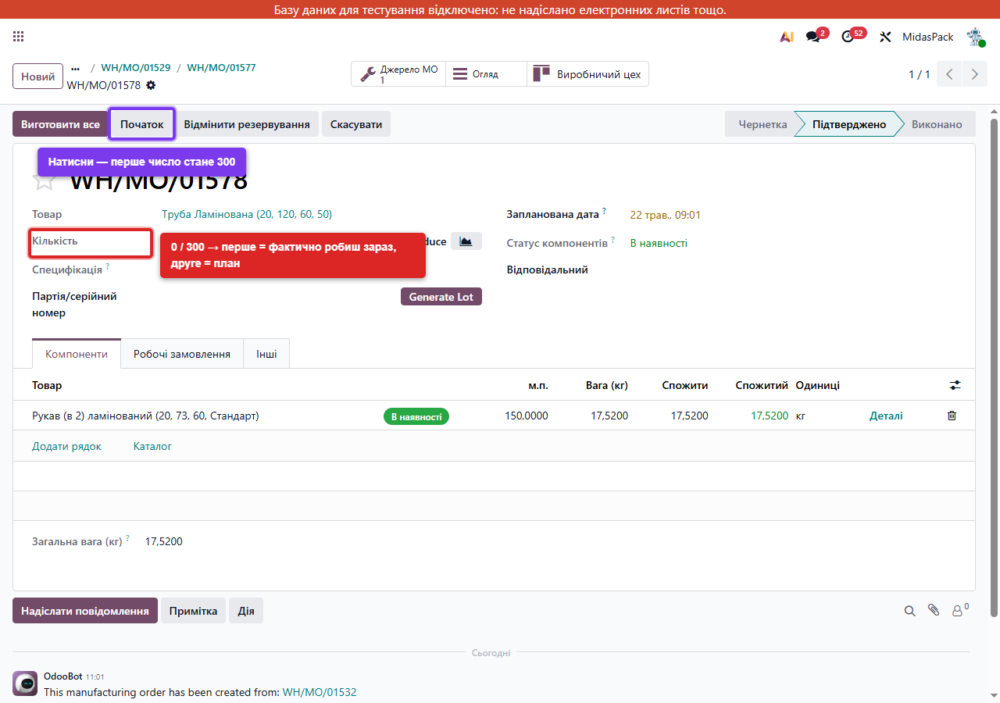
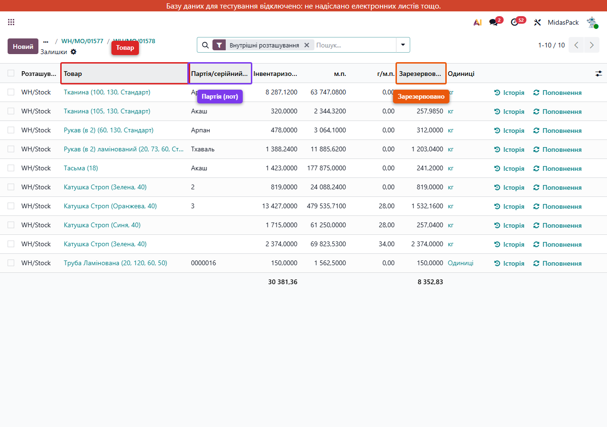

# PM-довідник: як насправді працює процес виробництва Midas в Odoo

Цей документ — **не для виробничої команди**. Він для тебе (як PM-координатора) і для Оксани. Тут пояснено **що відбувається в системі та чому**, простими словами і з реальними прикладами.

Інструкція для команди (де натискати) — у README цього репо. Цей же файл — для **бізнес-розуміння процесу**.

Документ покриває **4 з 5 пунктів** ТЗ (пункт 1 «Структура MO» повністю у README команди):
- Пункт 2 — Рекомендований порядок роботи з MO
- Пункт 3 — MO → склад → Delivery
- Пункт 4 — WIP / незавершене виробництво
- Пункт 5 — Ручна заміна сировини в одному MO

---

## Глосарій термінів

Щоб не плутатись по ходу — три ключові документи в Odoo:

- **Замовлення на продаж** (Sales Order, SO) — те, що замовив клієнт. Створюється з конфігуратора MidasPack.
- **Замовлення на виробництво** (Manufacturing Order, MO) — виробниче завдання, «виготовити стільки-то того-то». Створюється Odoo автоматично з SO.
- **Замовлення на доставку** (Delivery Order) — документ для складу, «відвантажити клієнту». Створюється Odoo автоматично після SO.

Плюс два терміни про дерево MO:

- **Головний (батьківський) MO** — на сам готовий товар (Біг-бег, Майка). Останній у послідовності виробництва.
- **Дочірній MO** — на частину готового товару (Полотно, Дно, Стропа). Виконуються першими.

Усе інше пояснимо по ходу.

---

## Приклад, який використовуємо в усьому документі

У всіх прикладах ми працюємо з реальним замовленням з тестового середовища — **`MO-01 150pcs`**: 150 шт `Біг-бег (Верхній клапан, Дно глухе)`.

Це дерево з 8 виробничих замовлень:

```
MO-01 150pcs           ← головний (Біг-бег, 150 шт)
│
├── 01527 Основа (170, 200, 170)
├── 01528 Верх (Верхній клапан)
│   ├── 01575 Труба Ламінована
│   └── 01576 Полотно Ламіноване
├── 01529 Дно (Дно глухе, 80, 160)
│   └── 01577 Полотно (80, 160, 110)
└── 01530 Стропа (Зелена, 40)
```

Глибина — до 4 рівнів (Тканина → Полотно → Дно → Біг-бег).

---

## Простими словами: як працює дерево MO

### Звідки беруться декілька MO замість одного

Один Біг-бег **не можна виготовити одним кроком**. Він складається з частин: Основа, Верх, Дно, Стропа. Деякі частини теж не «з нічого» — наприклад Дно виробляється з Полотна.

Тому Odoo на одне замовлення створює **дерево**: один головний MO + декілька дочірніх + іноді «внуки». **Усі народжуються одночасно**, коли підтверджується замовлення.

У нашому прикладі — 8 MO одночасно після підтвердження SO/MO-01.

### Як вони зв'язані: «дочірнє» і «джерело»

Не через окрему таблицю чи поле «батько». Через **кнопки навігації** на формі MO:

- На головному MO (батько) є кнопка **«Дочірні MO»** з цифрою — це список «дітей».


- На дочірньому MO (дитина) є кнопка **«Джерело MO»** — посилання назад на батька.


Між ними ходити двома кнопками. Це **видно прозоро**, без копіювання номерів.

### Як вони чекають один одного

**Батько чекає на дитину**, не навпаки:

- Доки дочірнє завдання не виконано — у батька статус компонентів **«Очікує»** (жовтий значок).
- Як тільки дочірнє стало «Виконано» — у батька цей статус **сам** змінюється на «В наявності» (зелений).
- Натиснути «Виготовити все» на батьку раніше — Odoo **не дозволить**: покаже діалог «Недійсна операція», бо частини ще нема.

Тому порядок виробництва завжди **знизу вгору**: спочатку найглибші дочірні, потім середні, останнім — головний.

### Що відбувається на складі, коли дочірнє стає виконаним

- На склад **надходить** виготовлена частина (наприклад 150 шт Полотна).
- Але вона **відразу резервується** для свого батька (Дно). Жодне інше замовлення цю партію не може забрати.

На рівні цифр: «фактично є» збільшується (Полотно: +150), але «прогноз з урахуванням бронювань» залишається 0 — бо все вже обіцяно своєму батькові.

Так Odoo гарантує, що жодна частина не загубиться по дорозі.

---

## Простими словами: що таке лоти і серійні номери

**Лот = бирка на партії товару.** Якщо за день виготовили 150 шт Полотна — це **одна партія** з одним номером (наприклад `0000014`). Якщо завтра виготовите ще 200 шт — це **інша партія** з іншим номером.

**Серійний номер** — те саме, але на кожну окрему штуку. У Midas серійні номери **не використовуються**. Скрізь — тільки лоти.

### Хто в Midas відстежується через лоти

- **Готова продукція** — Біг-бег, Майка, Полотно, Дно, Основа, Верх, Стропа і всі напівфабрикати.
- **Сировина** — Тканина, Нитка, Рукав, Тасьма. Лоти на неї створюються при прийомі від постачальника.

### Коли і як створюється лот

**Сам, без участі команди.** Як тільки виробничник натискає «Виготовити все»:

1. Odoo бачить що товар відстежується по партіях.
2. Бере наступний номер з лічильника (наприклад `0000013` → `0000014`).
3. Створює запис партії — товар, кількість, дата.
4. Прив'язує партію до того MO, який її виготовив.

На формі MO видно «партія `0000014`», у списку Партій — каталог всіх вироблених лотів.

### Що дає лот — реальний приклад

Через тиждень клієнт скаржиться: «у нас Біг-бег рветься».

**Без лотів** — невідомо що відповідати. «З якої тканини? Хто робив? Коли?»

**З лотами** — заходиш на партію Біг-бега, натискаєш «Відстеження», бачиш дерево:
- Цю партію виготовив MO такий-то.
- Туди пішли лоти Полотна, Дна, Стропи (з номерами).
- Лоти Полотна зроблені з лотів Тканини.
- Тканина — від постачальника X, рулон 47.
- Партія поїхала клієнтам A, B, C через Delivery такий-то.

Дзвониш постачальнику: «рулон 47 бракований, повертаємо». Зв'язуєшся з A, B, C — пропонуєш заміну. 10 хвилин.

Це і є **сенс лотів** — трасувати назад до сировини або вперед до клієнта.

### Що команді робити з лотами

**Нічого.** Odoo сам створює, прив'язує, будує траси. Команда лоти лише читає.

**Виняток:** при прийомі сировини від постачальника складар **може вписати номер вручну** (наприклад з накладної постачальника або з номера рулону). Або натиснути «згенерувати» — Odoo дасть свій. Як саме хочемо нумерувати сировинні лоти — окреме процедурне питання Оксани.

---

## Як налаштовано склад MidasPack

Це базове налаштування, на якому все працює. Для розуміння **дуже коротко:**

- **Один склад:** `MidasPack` (код `WH`).
- **Усі операції — 1 крок:** прийом від постачальника → одразу на склад; виробництво → через «віртуальну зону» одразу на склад; відвантаження → зі складу одразу клієнту. Без проміжних кроків (немає окремих pick/pack/quality зон).
- **Локації:**
  - `Vendors` — постачальники (звідки приходить сировина).
  - `WH/Stock` — основний фізичний склад.
  - `Production` — віртуальна транзитна локація (через неї проходять рухи, у самій залишається 0).
  - `Customers` — клієнти (куди йде готовий товар).

**Що це означає:** конфігурація мінімальна. Усе на одному `WH/Stock`. Це і просто, і обмежує (наприклад, немає окремої зони для напівфабрикатів — про це нижче в WIP).

---

# Пункт 2 ТЗ — Рекомендований порядок роботи з MO

6 підпунктів: чи треба завершувати дочірні перед батьком, типовий порядок дій, коли виставляється «фактично виробляється», чи лот вводиться руками, що бачить юзер без компонентів, поведінка `consumption=warning`.

### 2.1. Чи потрібно завершувати дочірні перед головним

**Так, обов'язково.** Це не рекомендація, а технічне обмеження Odoo.

**Сценарій:** виробничник заходить на головний `MO-01 150pcs` і одразу натискає «Виготовити все», коли дочірні (Основа, Верх, Дно, Стропа) ще не виконані.

**Що відбудеться:** Odoo покаже діалог **«Недійсна операція»** з переліком, чого бракує. MO не закриється.

**Чому так:** головний MO «з'їдає» компоненти, які виготовляються дочірніми. Якщо дочірні не готові — компонентів немає, виробляти Біг-бег нема з чого.

**Що це означає для команди:** починати завжди з найглибших дочірніх, далі вгору. Послідовність захищена системно — навіть якщо випадково натиснули неправильно, Odoo не пропустить.

### 2.2. Типовий порядок дій з одним MO

В Odoo один MO проходить через **1-3 кліки**.

**Сценарій з життя:** виробничник відкриває `WH/MO/01577` (Полотно з нашого дерева, статус компонентів «В наявності» / зелене).

**Послідовність:**

1. **(Опційно) Перевірте наявність** — якщо статус «Очікує» і щось щойно з'явилось на складі. Odoo перерезервує, статус стане «В наявності».
2. **(Опційно) Початок** — переводить MO у стан «У процесі». Корисно якщо треба зафіксувати **момент початку зміни**. Інакше можна пропустити.
3. **Виготовити все** — головний клік. MO переходить у «Виконано», створюються складські рухи, лот, оновлення зв'язків.

**Можна одразу 3-й крок** з Підтвердженого. Odoo сам зробить усе за один клік: і перевірить наявність, і виставить кількість «фактично виробляється», і завершить.

**Що це означає для команди:** на повсякденній роботі — **один клік «Виготовити все»**. Кроки 1-2 потрібні рідко.

### 2.3. Коли виставляється «фактично виробляється»

На формі MO зверху є поле «Кількість» у форматі **`0 / 150 Одиниці`** (два числа з косою).

- **Перше число** (`0`) — скільки **фактично зараз виробляється**.
- **Друге число** (`150`) — скільки **запланували** (з SO або вручну).



**Сценарій з життя:** запланували 150 шт Полотна, реально виробили 130 — тканини на 150 не вистачило.

**Що робити:**

- На стані Підтверджено перше число завжди `0`.
- Натиснувши «Початок» або «Виготовити все» — Odoo сам ставить `150 / 150` (повна порція).
- Можна **вручну виставити менше**, наприклад `130 / 150`. Тоді при «Виготовити все» Odoo каже: «фактично зробили 130, планували 150 — створимо **backorder** на залишок 20?». **Backorder** — це нове окреме MO на ті 20 шт, які не встигли. На завтра з'явиться.

**Що це означає для команди:** на 99% випадків нічого не редагувати — Odoo сам поставить план. Якщо виробили менше — виставити фактичне число, Odoo сам зробить «довиробництво» окремим MO.

### 2.4. Лот / серійний номер — auto чи руками

Все вже описано вище в розділі «Простими словами: лоти». Тут — короткий підсумок:

- **Готовий товар при «Виготовити все»:** лот створюється **автоматично**, користувач нічого не вводить.
- **Сировина при прийомі від постачальника:** складар може ввести номер вручну (з накладної постачальника) або згенерувати.
- **Серійних номерів у Midas немає.**

**Що це означає для команди:** виробничий процес не потребує жодного ручного введення лотів. Тільки складарі при прийомі сировини мають вибір — як саме називати лот.

### 2.5. Що бачить юзер, якщо компонентів немає

Два сценарії, два кольори.

**Жовтий «Очікує»** — компонент чекає, що його виготовить інше MO (дочірнє).

**Сценарій:** виробничник відкриває `WH/MO/01529 Дно`. Поле «Статус компонентів» — жовте «Очікує». Чому: у вкладці Компоненти видно «Полотно (80, 160, 110)» зі станом waiting, бо `WH/MO/01577 Полотно` ще не виготовлено.

**Що робити:** нічого, чекати. Як тільки 01577 буде завершено — Полотно з'явиться у Дна автоматично, статус стане «В наявності».

**Червоний «Немає в наявності»** — сировина закінчилась на складі.

**Сценарій:** виробничник відкриває `WH/MO/01527 Основа`. Статус компонентів — червоний. У вкладці Компоненти видно «Рукав (170, 200)» зі статусом «Немає в наявності». Це означає що **зовнішня сировина** (купується у постачальника) закінчилась.

**Що робити:**
1. Подивитись у вкладці «Компоненти», якого товару бракує.
2. Передати у постачання чи на склад інформацію (вручну — листом, чатом).
3. Коли товар з'явиться на складі — повернутись на MO, натиснути **«Перевірте наявність»**. Odoo перерезервує, статус стане зеленим.

**«Виготовити все»** з червоним статусом — Odoo не дасть, кнопка заблокована.

**Що це означає для команди:** жовте — це нормально, ждеш. Червоне — це сигнал у постачання. Жодних ризикових дій.

### 2.6. Поведінка «consumption = warning»

**Що це таке:** налаштування в кожному рецепті (Специфікації), яке каже Odoo **що робити, коли виробничник реально використав не рівно стільки сировини, скільки в рецепті**.

**Сценарій з життя:**

- Рецепт Полотна каже: на 1 шт треба `0,13 кг` Тканини. На 150 шт = `19,5 кг`.
- Реально виробничник розкроїв тканину і витратив `21 кг` (бо рулон не оптимально). Тобто **перевитрата 1,5 кг**.
- Виробничник тисне «Виготовити все».

Що Odoo робить — залежить від налаштування рецепту:

- **«Дозволено» (`flexible`)** — Odoo нічого не питає, MO закривається мовчки. Перевитрату ніхто не помітить.
- **«Дозволено з попередженням» (`warning`)** — Odoo показує діалог: «Ти списав на 1,5 кг більше Тканини, ніж планували. Підтвердити?». Виробничник тисне «Так» → MO закривається, **відхилення зафіксоване в історії**.
- **«Заблоковано» (`strict`)** — Odoo не дає закрити, тільки користувач з правами менеджера може клацнути «Підтвердити».

**Що вибрано в Midas:** усі **50 рецептів на dev — у режимі `warning`**. Це системне рішення.

**Чому саме `warning`:**

- `flexible` — небезпечно (тканина «зникає» без сліду).
- `strict` — паралізує (на кожну дрібну похибку треба менеджера).
- `warning` — компроміс: виробництво швидке, але всі відхилення лежать в історії.

**Що це означає для команди:** при кожному «Виготовити все», якщо реально витратив не рівно за рецептом, Odoo покаже діалог. Не лякатись — натиснути «Підтвердити». Якщо часто бачите великі відхилення на одному рецепті — повідомте Оксану чи Сергія, бо це сигнал що рецепт треба переглянути.

---

# Пункт 3 ТЗ — MO → склад → Delivery

4 підпункти: що відбувається на складі після виконання дочірнього MO, після головного MO, як оновлюється Sales Order, як працює Delivery.

### 3.1. Що відбувається на складі після виконання дочірнього MO

**Сценарій з життя:** виробничник натиснув «Виготовити все» на `WH/MO/01577 Полотно` (150 шт).

**Що відразу робить Odoo — два рухи товару:**

1. **Сировина списується:** `1,694 кг` Тканини (на 150 шт по рецепту) йдуть з `WH/Stock` у `Production`. На складі Тканини стає менше на 1,694 кг.
2. **Готовий товар надходить:** 150 шт Полотна з `Production` у `WH/Stock`. На складі Полотна стає більше на 150 шт.

Як це видно — на формі MO **smart-button «Переміщення товару»**:


Клік → відкриває список двох рухів зі стрілками «звідки → куди»:


**Лот для готового товару** створюється автоматично:


**Що це означає для команди:** виробничник нічого додатково не клацає. Зробив MO — склад оновлюється сам, лот створюється сам, історія залишається.

### 3.2. Що відбувається на складі після виконання головного MO

**Сценарій з життя:** усі дочірні Біг-бега виконані. Виробничник натискає «Виготовити все» на `MO-01 150pcs`.

**Що робить Odoo:**

- **Списує усі компоненти** — і напівфабрикати (Основа, Верх, Дно, Стропа), і чисту сировину (Нитка, Фарба, Кишеня). Усі рухи з `WH/Stock` у `Production`.
- **На склад надходить готовий товар:** 150 шт Біг-бега з `Production` у `WH/Stock`.
- **Створює лот** для цих 150 шт Біг-бега.

**Чистий ефект на склад:** усі складники зникли (бо «зʼїлись»), готовий товар з'явився на складі.

**Що це означає для команди:** головний MO виконується останнім, і саме після нього на складі з'являється те, що замовив клієнт.

### 3.3. Як оновлюється Sales Order

**Сценарій з життя:** клієнт замовив 150 шт Біг-бега. Створили SO `S00XXX`, з нього автоматично народилось дерево `MO-01 150pcs` + 7 дочірніх.

**Як SO «знає» що його виробляють:**

- На SO є smart-button «Виробництво» — клацнувши, бачимо всі MO які з нього породжені.
- На SO є поле **«Доставлена кількість»** (`qty_delivered`). Воно показує скільки шт **уже передано клієнту**.

**Важливо:** «Доставлена кількість» **НЕ оновлюється** одразу після виконання головного MO. Виготовлено = ще не доставлено. Поле оновлюється тільки **після підтвердження Delivery Order** (наступний підпункт).

**Що це означає для команди:** менеджер продажу може дивитись на SO і бачити статус виробництва (через smart-button), а потім доставки (через поле «Доставлена кількість»). Це **два окремих кроки**, не один.

### 3.4. Як працює Delivery Order

**Сценарій з життя:** менеджер створив SO у конфігураторі. Натиснув «Відправити в Odoo».

**Що відбувається в Odoo одночасно:**

- Створюється SO.
- Створюється MO (одне або дерево).
- **Створюється Delivery Order** у стані **«Очікує»** — він чекає, поки виготовиться головний продукт.


**Динаміка станів Delivery:**

1. **«Очікує»** (Waiting) — головний MO ще не готовий. DO просто висить.
2. **«Готово»** (Ready) — головний MO виконано, готовий товар у `WH/Stock` зарезервований під цей DO. Тепер можна підтверджувати.
3. **«Виконано»** (Done) — складар натиснув «Підтвердити». 150 шт списано з `WH/Stock` у локацію `Customers`. На SO «Доставлена кількість» оновлюється на 150.


**Важливо:** Delivery **не закривається сам**. Складар повинен натиснути «Підтвердити» вручну. Це навмисний контроль точки відвантаження.

**Окремий випадок:** якщо MO створено вручну (як наш `MO-01 150pcs` без SO) — Delivery Order **не з'являється** взагалі. Готовий товар просто лежить на складі. Це нормально для «виробництва у запас».

**Що це означає для команди:**

- Виробничник доводить MO до Done — не його турбота далі.
- Складар бачить нові DO у стані «Готово» — їх треба підтверджувати.
- Менеджер на SO бачить статус «Доставлено».
- Якщо позиція складаря і виробничника — одна людина (як зараз у MidasPack часто буває), вона робить обидва кроки сама.

---

# Пункт 4 ТЗ — WIP (незавершене виробництво)

4 підпункти: що таке WIP, як облікується в Midas, як побачити вільне vs зарезервоване, чому Midas обрав саме таку конфігурацію.

### 4.1. Що таке WIP

**WIP** (Work In Progress) — стан, коли **дочірній MO виконано** (напівфабрикат вже існує), а **батьківський MO ще не виконано** (напівфабрикат ще не «зʼїдений»).

**Сценарій з життя:** ми зробили 150 шт Полотна (`01577` готовий). А Дно (`01529`) і головний Біг-бег (`MO-01`) ще ні. Питання: **де зараз ті 150 шт Полотна** фізично і обліково?

Відповідь дамо в наступному підпункті.

### 4.2. Де фізично і обліково лежить напівфабрикат

Це і є те питання яке найчастіше плутає. Розкладу повністю.

**Спочатку важливе уточнення про локацію `Production`:**

У налаштуванні Odoo є локація `Production` («виробництво»). Вона **НЕ є складом** і **нічого не зберігає**. Це **транзитна точка**, через яку рухи проходять. Уявіть її як **двері складу**:

- Сировина (Тканина) **зайшла** через двері: `WH/Stock` → `Production`.
- Готовий продукт (Полотно) **вийшов** через двері: `Production` → `WH/Stock`.
- У самих дверях нічого не лежить — туди прийшло, звідти одразу вийшло.

Якщо подивитись на баланс локації `Production` для будь-якого товару — він завжди близько 0. Це **підтверджується через RPC:** для нашого MO 01523 (Полотно done) у локації `Production` зараз -1 шт Полотна (вийшло) і +0,13 кг Тканини (зайшло), у підсумку = 0.

**Тепер — де насправді лежить готовий напівфабрикат:**

На **основному фізичному складі `WH/Stock`** — той самий склад, де лежить **усе інше**: сировина, інші напівфабрикати, готова продукція. **Окремого «складу напівфабрикатів» у Midas немає.**

**Аналогія для розуміння:**

Уяви склад як одну велику кімнату. На полицях лежить **усе** разом: і Тканина (сировина), і Полотно (напівфабрикат), і готові Біг-беги. Біля деяких пачок Полотна стоять **обліковв таблички**: «зарезервовано для MO 01529, інші не чіпайте». Інші пачки Полотна — без табличок, вільні. Таблички — це **облікова бронь**, не фізичне розділення.

**Що це означає в Odoo:**

- **Фізично:** після Validate `01577` на полиці `WH/Stock` з'являються +150 шт Полотна. Поруч з рештою Полотен.
- **Обліково:** у записі товару Quants з'являється поле `reserved_quantity = 150`. Тобто з 150 шт фактично 150 заброньовано для 01529 Дно. Вільних 0.
- Інше замовлення (нове SO на Дно) **не отримає** цю партію — Odoo її не віддає.

**Як це бачить команда:** якщо подивитись на товар Полотно в списку Товарів — побачить «фактично є 150» і «прогнозовано 0» (бо 150 вже заброньовано). Тобто **фізично — є, обліково — обіцяно**.

**Підсумок:**

- `Production` — **транзитні двері**, нічого не зберігає.
- Готовий напівфабрикат — на **загальному `WH/Stock`** разом з усім.
- «Зарезервоване» vs «вільне» — це **облікова бронь** (поле `reserved_quantity` у Quants), не фізичне місце.

Окремої «WIP-локації» немає. Вона з'явилася б тільки у 3-step Manufacturing — окрема техзадача (див. підпункт 4.4).

### 4.3. Як побачити «вільне» vs «зарезервоване»

Безпосередньо у списку Товарів — **не видно** прямо. Видно лише загальну кількість.

Але є **три способи** розібратись.

**Спосіб 0 (найзагальніший) — сторінка «Запаси» (Quants):**

Шлях у меню: **Склад → Звітність → Запаси**. Покроково:
1. Із головної сторінки Odoo — натиснути на застосунок **«Склад»**.
2. У верхньому горизонтальному меню — натиснути **«Звітність»**.
3. У випадаючому списку обрати **«Запаси»**.

Це список **усіх товарів на всіх локаціях** з розбивкою по партіях і резервах.



На скріні видно колонки:
- **Товар** і **Партія** (лот).
- **Інвентаризовано** — скільки фактично лежить.
- **Зарезервовано** — скільки заброньовано під відкриті MO.

Приклади з нашого dev:
- `Тканина (100, 130, Стандарт)`, лот «Арпан» — 8287 кг фактично, **1206 кг зарезервовано**. Вільних 7081 кг.
- `Катушка Строп (Зелена, 40)` — 2374 шт фактично, **всі 2374 зарезервовано** (вільних 0).
- `Труба Ламінована (20, 120, 60, 50)`, лот `0000016` — 150 шт фактично, **всі 150 зарезервовано** (це наш напівфабрикат з дерева, забронений під батьківський Верх).

**Це найзручніший спосіб для PM** — видно одразу всі резервації по партіях.

Інші два способи — для конкретного MO або конкретного товару.

**Спосіб 1 — на рівні MO**, через smart-button «Дочірнє MO».

**Сценарій:** відкриваємо `WH/MO/01529` (Дно). Угорі видно smart-button **«1 Дочірнє MO»**:


Цифра «1» означає: цей MO залежить від 1 іншого MO, який ще не виконаний (`01577 Полотно`). Як тільки 01577 стане Done, цифра впаде на 0 і статус компонентів зміниться з «Очікує» на «В наявності».

**Що це означає:** smart-button — це **простий WIP-індикатор**. Дивишся: «1 Дочірнє MO» = щось ще в роботі.

**Спосіб 2 — на рівні товару**, через картку самого товару.

**Сценарій:** відкриваємо товар `Рукав (в 4) (180, 140, 4RZ)` у Складі. Угорі smart-button показує:


Видно цифри: **`304` шт фактично є на складі**, але **прогноз `-5751` шт** (мінус!). Це означає що відкритих MO замовили цього Рукава **на 6055 більше**, ніж зараз є. Сигнал: треба замовляти у постачальника.

**Що це означає для команди:** якщо хочеш реального дефіциту — дивись на «Прогноз», а не на «фактично є».

### 4.4. Чому Midas обрав 1-step (без окремої WIP-локації)

Простіша конфігурація:
- менше клацань для виробничника;
- менше навчання команди;
- менше можливих помилок.

**Альтернатива** — 3-step Manufacturing з окремою локацією для напівфабрикатів (типу `WH/WIP`). Це дає кращу видимість «склад напівфабрикатів окремо», але вимагає:
- Додатковий етап клацання на кожному MO.
- Окремі правила для рухів.
- Кастомне налаштування Odoo.

**Що це означає для Оксани:** зараз у Midas немає виділеного «складу напівфабрикатів». Якщо команда хоче побачити «скільки готових частин зараз чекає на збірку» — треба заходити в кожен головний MO і дивитись smart-button. Якщо хочемо побачити це **в одному списку як склад** — це **окрема техзадача** для розробників. Поточне рішення (1-step) — свідомий компроміс.

---

# Пункт 5 ТЗ — Ручна заміна сировини в одному MO

6 підпунктів: чи можна, як це зробити, що з резервацією, чи потрібен Check Availability після, чи можна додати/видалити рядок, чи змінюється шаблонний рецепт, чи фіксується в історії.

### 5.1. Чи можна змінити компонент у підтвердженому MO

**Так**, але **тільки через delete + add** (видалити старий рядок і додати новий). Прямо в полі «Товар» одного рядка — заблоковано.

**Сценарій з життя:** конфігуратор підібрав `Тканина (100, 130, Стандарт)`. Реально хочемо `Тканина (105, 130, Стандарт)` — інший рулон, інший постачальник.

**Як зробити:**

1. Відкрити MO у стані Підтверджено, переключитись на вкладку «Компоненти».
2. Праворуч на рядку «Тканина (100, 130, ...)» натиснути **іконку кошику** 🗑 — рядок зникне.
3. Унизу натиснути **«Додати рядок»** — з'явиться порожній.
4. У поле «Товар» вписати `Тканина (105, 130, Стандарт)`, у «Спожити» — потрібну кількість.
5. Клацнути в порожнє місце — Odoo автозбереже.


**Що це означає для команди:** редагувати прямо назву товару в рядку не можна (Odoo блокує). Тільки видалити + додати новий. Це логічно: Odoo захищає від випадкових змін.

### 5.2. Що з резервацією після заміни

**Сценарій:** ми тільки що замінили Тканину `100, 130` на `105, 130`.

**Що Odoo робить автоматично:**

- Стара Тканина (`100, 130`) — розрезервувалась. Її 0,13 кг знову вільні.
- Нова Тканина (`105, 130`) — **автоматично перерезервувалась**, бо є на складі.
- Статус компонентів стає (або залишається) «В наявності» (зелене).

**Якщо нової Тканини на складі не вистачає** — статус буде «Немає в наявності» (червоне). Тоді доводиться чекати поставки, як описано в розділі 2.5.

**Що це означає для команди:** після заміни **нічого додатково не треба натискати** (якщо сировина на складі є). MO готовий до Validate.

### 5.3. Чи потрібен «Перевірте наявність» після заміни

**Зазвичай ні.** Резервація відбувається сама.

**Виняток:** якщо нової Тканини на складі **не було**, а потім вона з'явилась — тоді треба натиснути «Перевірте наявність» вручну, щоб Odoo резервував.

**Що це означає для команди:** не клацати зайвого. «Перевірте наявність» — це резервна кнопка для випадку «щойно отримали з'я в склад товар, перерезервуй».

### 5.4. Чи можна додавати / видаляти рядки взагалі

**Так**, обидва дії дозволені:

- **Додати додатковий компонент:** натиснути «Додати рядок», вибрати товар і кількість. Корисно якщо для конкретної серії треба ще один матеріал, не передбачений рецептом.
- **Видалити рядок без заміни:** натиснути іконку кошику і не додавати нічого. Корисно якщо реально без цього обходимось.
- **Змінити кількість компонента (без зміни товару):** клацнути прямо в число у колонці «Спожити», ввести нове. Це працює навіть у Підтвердженому стані.

**Що це означає для команди:** робота з компонентами в Confirmed MO **гнучка**. Не подобається — змінюй.

### 5.5. Чи змінюється шаблонний рецепт (Специфікація)

**Не змінюється.** Це принципово.

**Сценарій:** ми замінили Тканину `100, 130` на `105, 130` у конкретному MO 01577.

**Що сталося:**
- У MO 01577 рядок компонента — `105, 130`.
- У **рецепті** (BOM-шаблоні, наприклад `PLT-DNO-BB-Ф-ГД-cfdf22a3`) — **досі `100, 130`**, як було.

**Чому це правильно:** один разовий випадок не повинен переписати рецепт для всіх майбутніх замовлень. Якщо завтра зробимо ще одне MO за тим самим рецептом — там знову буде `100, 130` (не `105, 130`).

**Що це означає для команди:** заміна в одному MO — **локальна**, не глобальна. Якщо команда систематично використовує іншу тканину — це сигнал змінити рецепт у конфігураторі (через Діму/розробників), а не міняти кожного разу руками.

### 5.6. Чи фіксується факт заміни в історії

**НЕ фіксується.** Це **дірка в аудиті**.

**Сценарій:** ми замінили Тканину. Заходимо у стрічку подій (чатер) MO. Бачимо тільки два записи: «створено» і «MO Confirmed». Запису «замінено Тканину з X на Y» **немає**.


**Чому так:** Odoo за замовчуванням пише в чатер тільки зміни **полів самого MO** (state, дати). Зміни в **рядках компонентів** не пишуться. Це поведінка з коробки, не баг.

**Що це означає для команди:** якщо завтра треба буде розібратись «хто і коли замінив тканину» — слідів не лишилось.

**Як з цим жити поки** (поки немає кастомного аудиту):
- Кожного разу при заміні виробничник **залишає примітку вручну** в чатері: натискає «Надіслати повідомлення» / «Примітка» в правому верхньому куті і пише «замінено Тканина X на Y, причина: ...».
- Так слід зберігається у чатері, його можна знайти.

Це **процедурне рішення**, а не технічне. Залежить від дисципліни команди.

---

## Запитання до Оксани

Список того, що **не вирішується технічно** — потребує бізнес-рішення:

1. **Чи треба «склад напівфабрикатів» окремо?** Зараз його немає (1-step Manufacturing). Якщо команда хоче бачити окремо «що вже виготовлено, чекає на наступний крок» — це техзадача на 3-step Manufacturing. Якщо ні — лишаємо як є.

2. **Хто підтверджує Delivery Order?** Якщо виробничник і складар — одна особа (зараз у MidasPack так), питання нерелевантне. Якщо різні — потрібно узгодити процедуру.

3. **Аудит ручної заміни сировини** — критично чи ні? Якщо так — техзадача на кастомний audit-trail. Якщо ні — впроваджуємо правило «ручна примітка при заміні».

4. **Як називати лоти сировини при прийомі?** Складар може вводити номер вручну (з накладної постачальника / рулону) або генерувати автоматично. Це окреме рішення Оксани.

5. **Налаштування `consumption=warning`** на всіх рецептах — це свідомий вибір. Чи команда його розуміє? Можливо для критичних рецептів (типу клейових) варто `strict`, а для нормальної сировини — `warning`. Це рішення Сергія/Миколи.

---

## Що ще лишається з ТЗ

Пункт 1 (структура MO) — повністю покрито в README команди.

Технічні моменти, які залишаються відкритими для подальшого аналізу:

- Кастомні модулі `midaspack_dual_uom` (подвійні одиниці виміру — м.п./кг) і `midaspack_formular` (звітна форма). Як вони впливають на UI і звітність — окремий ресерч.
- Наскрізний приклад «реальне SO → дерево MO → Delivery» поки немає на dev (середовище перезавантажується щоночі, SO видаляються). Для повноцінного тестування потрібне стабілізоване середовище.
