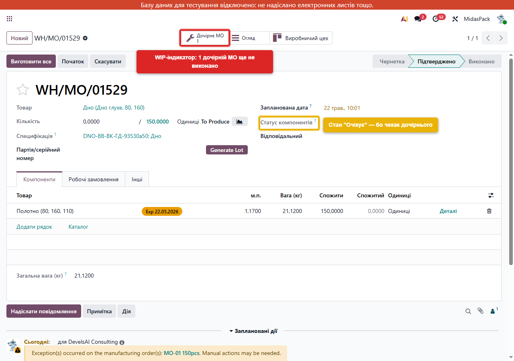
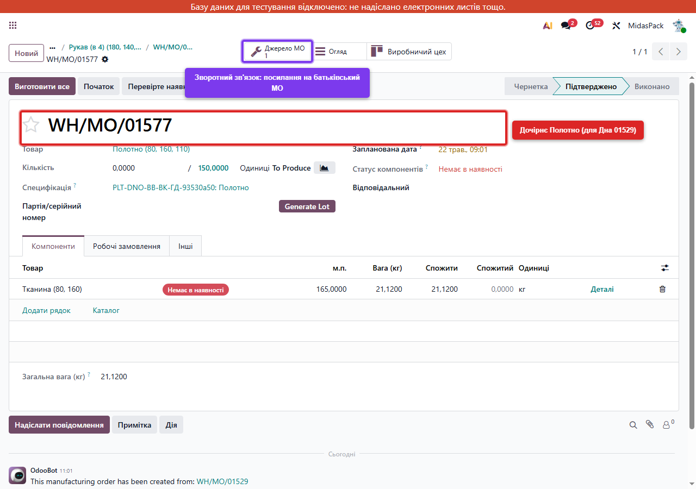
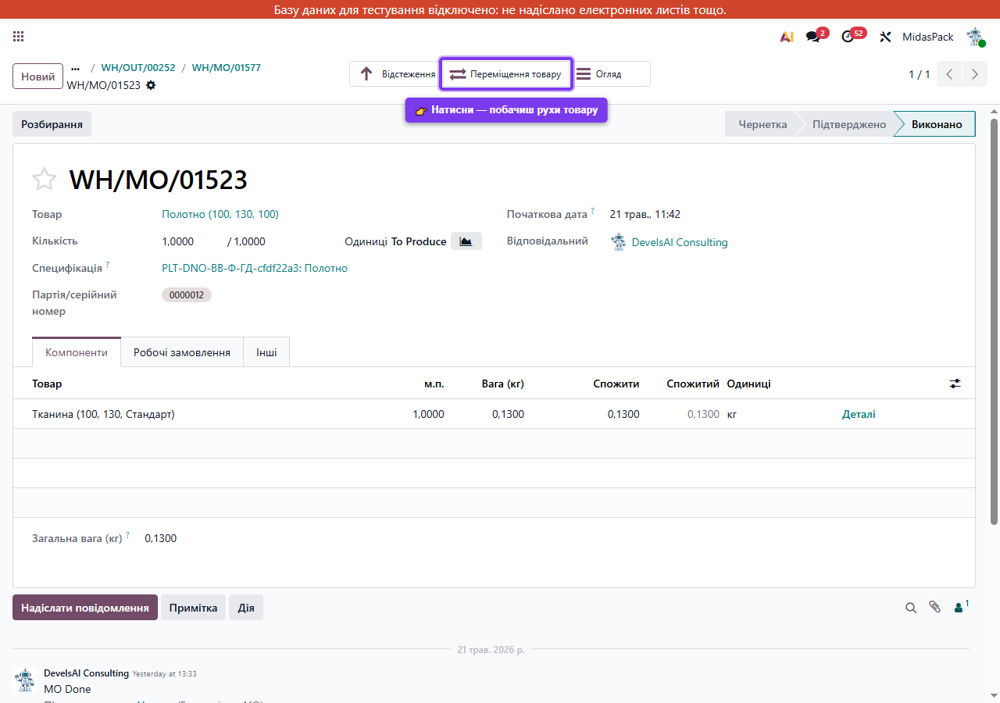
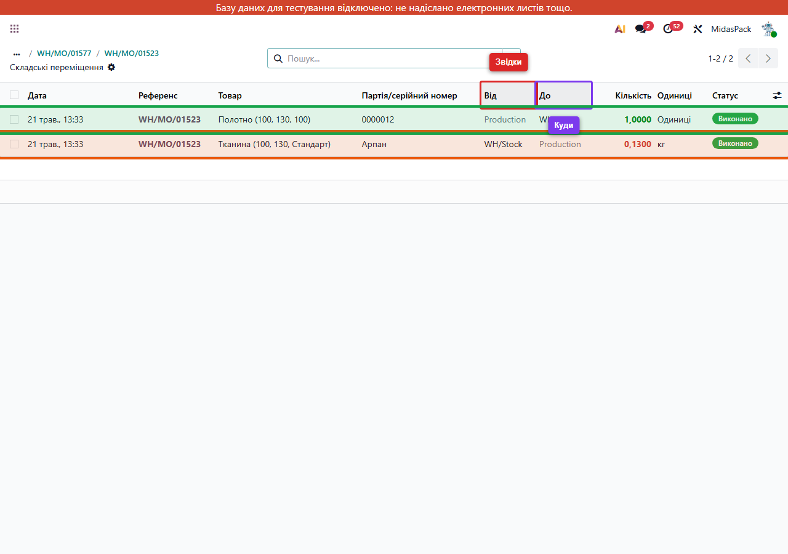
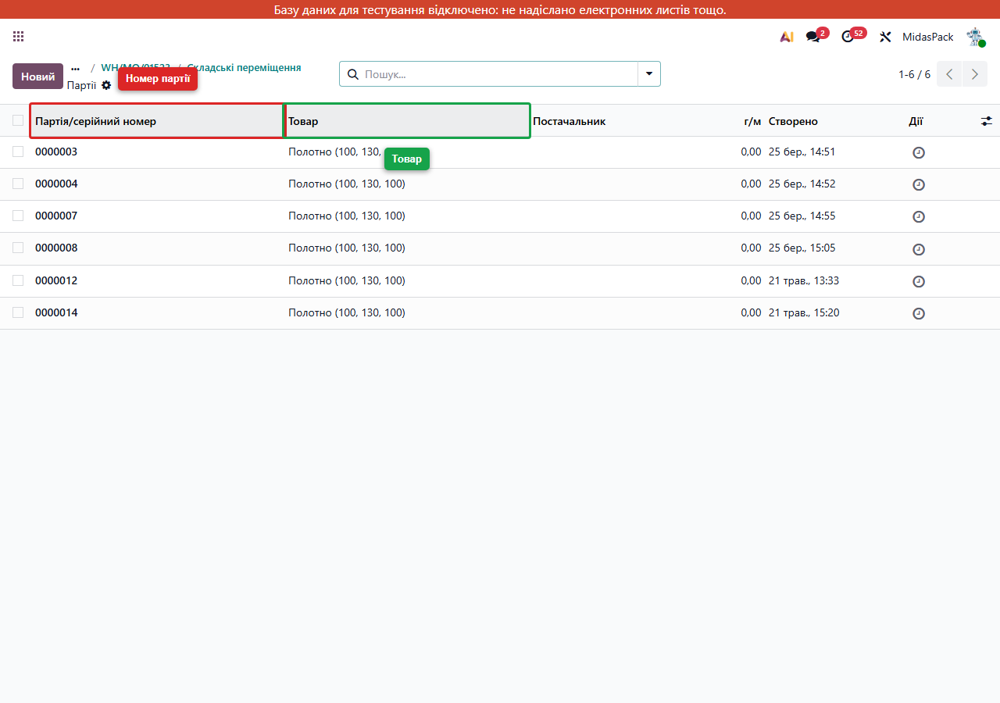
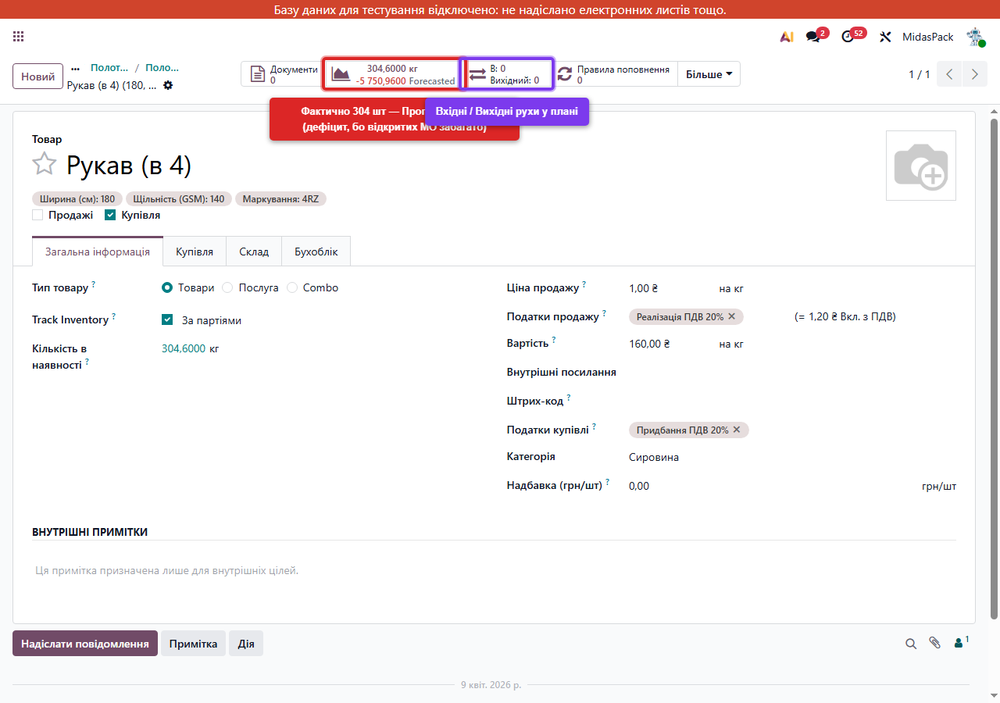

# PM-довідник: як насправді працює процес виробництва Midas в Odoo

Цей документ — **не для виробничої команди**. Він для тебе (як PM-координатора) і для Оксани. Тут пояснено **що відбувається в системі та чому**, не «куди тиснути».

Покриває три з п'яти пунктів дослідження з ТЗ:
- **Пункт 3:** MO → склад → Delivery
- **Пункт 4:** WIP / незавершене виробництво
- **Пункт 5:** Ручна заміна сировини

Інструкція для команди — у README цього репо.

---

## Простими словами: як це все працює

(розділ написано для першого прочитання — без термінів і моделей. Технічні деталі — нижче, в окремому розділі)

### Звідки беруться декілька MO замість одного

Один Біг-бег **не можна виготовити одним кроком**. Він складається з частин: Основа, Верх, Дно, Стропа. Кожна частина — це окреме завдання, на нього свій MO. Деякі частини теж не «з нічого» — наприклад Дно виготовляється з Полотна, а Полотно — окреме завдання, ще на один MO.

Тому Odoo на одне замовлення створює **ціле дерево завдань**:
- Один **головний MO** — на готовий Біг-бег
- Декілька **дочірніх MO** — кожен на свою частину
- Іноді ще «внуки» — якщо частина теж має складник, який виготовляється

У нашому прикладі `MO-01 150pcs`: один головний (Біг-бег) + 4 дочірніх (Основа, Верх, Дно, Стропа) + 3 «внуки» (Полотно, Полотно Ламіноване, Труба Ламінована). Разом 8 завдань — і всі народжуються **одночасно**, як тільки замовлення підтверджено.

### Чому це не плутанина

Бо всі ці MO в одній команді. У них однакове поле **«Джерело»** (тут — `MO-01 150pcs`). За цим джерелом можна знайти всю групу.

Плюс Odoo підказує сам, в обидва боки:
- На головному MO є кнопка **«Дочірні MO»** з цифрою — клацнув і одразу бачиш список «дітей».
- На дочірньому MO є кнопка **«Джерело MO»** — клацнув і потрапив до батька.

Між ними ходити через ці дві кнопки. Це **видно прозоро**, без жодного «копіювати-вставляти» номера.

### Як вони «чекають один одного»

Просте правило: **батько чекає на дитину**.

- Допоки дочірнє завдання не виконано — у батька статус компонентів **«Очікує»** (жовте).
- Як тільки дочірнє стало «Виконано» — у батька цей самий статус **сам** змінюється на «В наявності» (зелене).
- Натиснути «Виготовити все» на батьку раніше — Odoo **не дозволить**: покаже діалог «Недійсна операція», бо частини ж ще нема.

Звідси послідовність: **починай завжди знизу**, з найглибших дочірніх. Працюй угору. Останнім — головний MO.

### Що відбувається на складі, коли дочірнє стає Виконаним

- На склад **надходить** виготовлена частина (наприклад 150 шт Полотна).
- Але вона **відразу резервується** для свого батька (Дно). Жодне інше замовлення цю партію не може забрати.

Тобто на складі число «фактично є» збільшується (Полотно: +150), але «прогноз з урахуванням бронювань» залишається 0 — бо все вже обіцяно своєму батькові.

Так Odoo гарантує, що **жодна частина не загубиться** по дорозі до головного MO.

---

## Простими словами: що таке лоти і серійні номери

**Лот = бирка на партії товару.** Якщо за день виготовили 150 штук Полотна — це **одна партія** з одним номером, наприклад `0000014`. Якщо завтра виготовите ще 200 шт — це **інша партія** з іншим номером.

**Серійний номер** — те саме, але на кожну окрему штуку. У Midas серійні номери **не використовуються**: для біг-бегів немає сенсу нумерувати кожен окремо. Скрізь — лоти.

### Хто в Midas відстежується через лоти

- **Готова продукція** — Біг-бег, Майка, Полотно, Дно, Основа, Верх, Стропа і всі напівфабрикати. На кожну партію створюється лот.
- **Сировина** — Тканина, Нитка, Рукав, Тасьма. На неї лоти теж є, але створюються при прийомі від постачальника, а не при виробництві.

### Коли і як створюється лот при виробництві

**Сам, без участі команди.** Як тільки натиснули «Виготовити все»:

1. Odoo бачить, що готовий товар відстежується по партіях.
2. Бере **наступний номер з лічильника** (просто `0000013` → `0000014` → `0000015`).
3. Створює запис партії: товар, кількість, дата.
4. Прив'язує партію до того MO, який її виготовив.

На формі MO потім видно: «партія `0000014` зроблена цим замовленням». У списку «Партії» (Склад → Товари → Партії) — каталог усіх лотів.

### Що дає лот: реальний приклад

Через тиждень клієнт скаржиться: «у нас Біг-бег рветься».

**Без лотів** — невідомо що відповідати. «Який саме? З якої тканини? Хто робив? Коли?»

**З лотами** — заходиш на партію цього Біг-бега в Odoo, натискаєш кнопку **«Відстеження»**. Відкривається дерево:
- Цю партію Біг-бега виготовив MO такий-то такого-то числа.
- Туди пішли лоти Полотна, Дна, Стропи (з номерами).
- Ці лоти Полотна зроблені з лотів Тканини (з номерами).
- Тканина — від постачальника такого-то, рулон номер 47.
- Біг-беги з цієї партії поїхали клієнтам ABC, DEF, GHI через Delivery Order такий-то.

Дзвониш постачальнику: «партія тканини з рулону 47 бракована, повертаємо». Зв'язуєшся з ABC, DEF, GHI і пропонуєш заміну. Все за 10 хвилин.

Це і є **сенс лотів** — будь-яку партію можна простежити назад (до сировини і постачальника) і вперед (до клієнта).

### Що команді робити з лотами

**Нічого.** Odoo сам:
- Створює лот при кожному виконанні MO.
- Прив'язує лот до руху товару.
- Будує траси у звіті «Відстеження».

Команда бачить лоти лише як інформацію — номер партії на формі MO, у списку Партій, у звіті відстеження.

**Виняток одне:** при прийомі сировини від постачальника складар може **вписати номер лоту вручну** (наприклад, з накладної постачальника або з рулону). Або натиснути «згенерувати» — і Odoo згенерує свій. Як саме команда хоче нумерувати лоти сировини — це окреме процедурне рішення Оксани.

---

## Як батьківські та дочірні MO зв'язані між собою (технічна частина)

Перш ніж розкладати кожен з трьох пунктів, треба зрозуміти **базовий механізм зв'язку**. Усі три пункти крутяться навколо цього механізму.

### Хто кому батько

В одному дереві MO (наприклад наше `MO-01 150pcs`) є **один кореневий MO** (готовий Біг-бег) і **декілька дочірніх** (на частини: Полотно, Дно, Верх, Стропа...). Деякі дочірні мають своїх дочірніх — і так до сировини.

Логіка простої:
- **Кореневий MO** — той, чий товар замовив клієнт. У SO-маршруті це остання ланка.
- **Дочірній MO** — той, чий **готовий продукт є компонентом іншого MO**. Він існує лише тому, що його продукт потрібен якомусь батькові.

У нашому прикладі:
- Кореневий: `MO-01 150pcs` (Біг-бег)
- Його дочірні: 01527 Основа, 01528 Верх, 01529 Дно, 01530 Стропа
- Внуки (дочірні дочірніх): 01575 Труба Ламінована, 01576 Полотно Ламіноване (обидва діти 01528 Верх), 01577 Полотно (дитина 01529 Дно)

### Звідки взагалі беруться дочірні MO

Не з повітря. Дочірній MO **створюється автоматично**, коли:
1. У товара (компоненту батьківського MO) увімкнено маршрут **`Manufacture`** (виготовляється).
2. **Плюс** увімкнено маршрут **`Replenish on Order (MTO)`** (Make To Order — створювати нове під замовлення, а не брати зі складу).

Тоді при підтвердженні батьківського MO Odoo каже сам: «А цей компонент — спорадично виготовлений під замовлення, отже треба створити ще один MO на нього». І створює.

Якщо в товара тільки `Manufacture` без `MTO` — Odoo бере його зі складу, якщо є; якщо нема — все одно не створює автоматично, чекає окремої дії.

У Midas усі напівфабрикати (Основа, Верх, Дно, Стропа, Полотно, Труба Ламінована...) налаштовані з **обома маршрутами** — тому дерево MO з'являється цілком саме після конфігуратора.

### Як технічно з'єднані батько і дитя

Не через окреме поле «parent_id» на MO. Зв'язок іде **через рухи товару (stock.move)**:

- На кожному компоненті батьківського MO є запис `stock.move` (raw move).
- У цього запису поле **`move_orig_ids`** — посилання на **готовий рух (`move_finished`)** дочірнього MO, який має постачити цей компонент.
- Тобто Odoo каже raw-руху батька: «не йди шукати товар на склад — твій товар прийде ось з цього іншого move'у, який зараз виготовляється».

Зворотний зв'язок: на готовому move дочірнього MO поле **`move_dest_ids`** — посилання назад на raw move батька. Це той самий зв'язок, видний з іншого боку.

Технічно це означає: **готовий продукт дочірнього MO навіть не доходить до загального складу** — він одразу «забронюється» батьківським raw move'ом. Хоча фізично проходить через `WH/Stock`, обліково з нього ж відразу і йде.

### Як це видно в UI

В Odoo цей зв'язок видно через **smart-buttons**:

**На батьківському MO** (`WH/MO/01529` Дно):

Кнопка **«1 Дочірнє MO»** — показує що Дно залежить від одного незавершеного дочірнього (це 01577 Полотно). Цифра збігається з кількістю `wip_move_count`.

**На дочірньому MO** (`WH/MO/01577` Полотно, до якого ми перейшли натисканням):

Кнопка **«1 Джерело MO»** — посилання назад на батька (Дно 01529). Це **зворотний навігаційний шлях**.

### Динаміка: що відбувається коли дочірній стає Done

Покроково:

1. Дочірній MO (`01577 Полотно`) у стані Confirmed/Assigned. Його готова продукція ще не існує.
2. Виробничник натискає «Виготовити все» на 01577.
3. **stock.move готового продукту** з 01577 переходить у стан `done`. 150 шт Полотна формально «надходять» на склад.
4. **stock.move raw** на батьківському MO (01529 Дно), який мав посилання `move_orig_ids → готовий move 01577`, тепер бачить що джерело виконано — і **сам переходить** з `waiting` у `assigned`.
5. Якщо це був останній waiting компонент 01529 — статус компонентів самого 01529 змінюється з `Очікує` (жовте) на `В наявності` (зелене).
6. Smart-button «1 Дочірнє MO» на 01529 показує тепер `0`, бо незавершених дочірніх більше немає.
7. 01529 готовий до Validate. Виробничник тисне «Виготовити все» — і ланцюгом запалюється Біг-бег.

### Чому послідовність важлива

Не можна Validate-нути батьківський перш за дочірніх:
- Якщо у компонента стан `waiting` — Odoo каже **«Недійсна операція»** і не дає Validate.
- Цю помилку команда бачить як діалог «You need to supply a Lot/Serial Number for...» (бо waiting компонент не має лоту, бо ще не виготовлений).

Тому єдиний правильний шлях — **знизу вгору**: спочатку найглибші дочірні (сировина → перший напівфабрикат), потім середні, потім кореневий.

### Що сказати Оксані одним абзацом

> «Дочірні MO — це не окремі виробничі завдання “між собою”, а **ланки одного ланцюга**, який народжується одночасно з кореневого MO через маршрути Manufacture+MTO. Зв'язок між батьком і дитиною — через stock.move (поля `move_orig_ids` / `move_dest_ids`), а команда бачить це як smart-buttons «Дочірнє MO» / «Джерело MO» в UI. Послідовність виконання — суворо знизу вгору; інакше Odoo блокує Validate. Це не власна логіка Midas — це стандартна поведінка Odoo Manufacturing з MTO маршрутами.»

---

## Як налаштовано склад MidasPack (контекст для розуміння)

Перш ніж розбирати MO/склад/Delivery, треба знати **базове налаштування складу**, на якому все працює.

**Склад:** один — `MidasPack` (код `WH`).

**Кроки руху товару:**
- Прийом (Receipts): **1 крок** — від постачальника одразу на склад.
- Виробництво (Manufacturing): **1 крок** — зі складу через «віртуальну виробничу зону» назад на склад.
- Відвантаження (Delivery): **1 крок** — зі складу до клієнта без проміжних pick/pack/ship операцій.

**Локації:**
- `Vendors` (постачальники) — звідки приходить сировина.
- `WH/Stock` (склад) — основний фізичний склад. Все, що є, лежить тут.
- `Production` (виробництво) — **віртуальна транзитна** локація. Через неї рухи проходять, але кількість у ній завжди близько 0.
- `Customers` (клієнти) — туди йде готовий товар.
- `Inventory adjustment` — для коректировок.

**Що це означає:** конфігурація **мінімальна**. Немає окремих зон pre-production / post-production / quality / packing. Усе на одному `WH/Stock`. Це і просто, і обмежує — про обмеження нижче.

---

## Пункт 2 — Рекомендований порядок роботи з MO

ТЗ просить дослідити 6 моментів: чи треба завершувати дочірні перед батьком, типовий порядок дій (Check Availability → Set Quantities → Validate), коли виставляється `qty_producing`, чи лот вводиться руками, що бачить юзер без компонентів, поведінка `consumption=warning`. Розкладу кожне.

### 2.1. Чи потрібно завершувати дочірні перед головним

**Так, обов'язково.** Це не рекомендація, а технічне обмеження Odoo: якщо у головного MO є хоча б один компонент у стані «Очікує» (тобто чекає на дочірнє), Validate (натискання «Виготовити все») **не пройде**. Odoo покаже діалог «Недійсна операція» з переліком, чого бракує.

Тому шлях у виробництві строго **знизу вгору**:
1. Спочатку MO найглибших дочірніх (там тільки сировина, вони готові до Validate першими).
2. Потім середні (Полотно → Дно → Біг-бег у нашому прикладі).
3. Останнім — головний MO.

Команда не може «забутися і запустити Біг-бег першим» — Odoo її просто не пустить. Це **захист на рівні системи**.

### 2.2. Типовий порядок дій з одним MO

В Odoo один MO проходить через 3-4 кліки:

1. **(Опційно) Перевірте наявність** — натискається, якщо статус компонентів «Очікує» і ви очікуєте, що нова поставка вже на складі. Odoo перевірить чи можна резервувати компоненти і змінить стан на «В наявності».
2. **(Опційно) Початок** — переводить MO зі стану «Підтверджено» у «У процесі». На цьому етапі заповнюється `qty_producing` (про нього нижче).
3. **Виготовити все** — головний клік, переводить у «Виконано». Створює складські рухи, лот, оновлює зв'язки.

**Опціональність:** кроки 1 і 2 можна **пропустити**. Якщо одразу натиснути «Виготовити все» з Підтверджено — Odoo сам зробить усе за вас: і перевірить наявність, і виставить qty_producing, і завершить. Користуватись «Початок» окремо — корисно тільки коли треба зафіксувати **час початку зміни** (наприклад фіксуєте що почали зранку, а закінчили ввечері).

### 2.3. Коли і як виставляється «фактично виробляється»

На формі MO зверху є поле «Кількість» у форматі **`0 / 150 Одиниці`** (два числа з косою рискою). Поясню що це:

- **Перше число** (`0` на початку) — скільки **фактично зараз виробляється** цим MO. Технічна назва в Odoo: `qty_producing`.
- **Друге число** (`150`) — скільки **запланували** за замовленням. Технічна назва: `product_qty`.

Як перше число змінюється:

- **На стані Підтверджено:** `0 / 150`. Ще не починали.
- **Натиснули «Початок»:** перше число одразу стає `150 / 150`. Odoo сам ставить: «починаємо виробляти всі заплановані 150 шт».
- **Натиснули «Виготовити все» одразу з Підтверджено:** той самий ефект — Odoo сам виставить `150 / 150` і закриє MO.
- **Можна редагувати перше число вручну.** Наприклад, виставити `100 / 150`. Тоді при «Виготовити все» Odoo каже: «фактично зробили 100, а планували 150 — створимо **backorder** на залишок 50 шт?». Backorder — це окреме нове MO на ті 50 штук, які не встигли.

Сценарій з життя: «Запланували 150 шт Полотна, виготовили 130 — тканини забракло. Решта завтра». Виробничник виставляє `130 / 150`, тисне «Виготовити все», Odoo пропонує backorder → на завтра з'являється MO на 20 шт (на залишок, який не зробили).

**Просто кажучи:** перше число завжди починається з 0, а як ти натискаєш «Початок» або «Виготовити все» — Odoo сам ставить туди план. Якщо виробив менше — можеш редагувати вручну, тоді створиться окреме MO на залишок.

### 2.4. Лот/серійний номер — auto чи руками

Для **готового товару** при Validate: **AUTO**. Користувач нічого не вводить. Odoo бере наступний номер з лічильника (наприклад `0000014`). Можна після перейменувати, але це окреме рішення.

Для **сировини** при прийомі від постачальника: складар або вводить руками (наприклад номер з накладної), або тисне «згенерувати». У Midas налаштування дозволяє обидва шляхи — `use_create_lots = True` і `use_existing_lots = True`.

У Midas **серійних номерів немає взагалі** — все по лотах (партіях). Це нормально для нумерації груп біг-бегів.

### 2.5. Що бачить юзер, якщо компонентів немає

Два сценарії:

**Жовтий «Очікує»** — компонент чекає, що його виготовить інше MO (дочірнє). Це нормальний робочий стан, нічого не треба робити: коли дочірнє MO буде завершено, статус автоматично зміниться на «В наявності».

**Червоний «Немає в наявності»** — сировина закінчилась на складі. Тут треба:
1. Подивитись у вкладці «Компоненти», якого саме товару бракує (червоний значок поруч).
2. Передати у постачання чи склад інформацію.
3. Коли товар з'явиться — натиснути на формі MO кнопку **«Перевірте наявність»**. Odoo перерезервує, статус стане зеленим, можна Виготовити.

«Виготовити все» з червоним статусом — заблоковано. Odoo не дасть.

### 2.6. Поведінка `consumption = warning`

У Midas на dev **усі 50 BOM налаштовані як `warning`** («Allowed with warning» / «Дозволено з попередженням»).

Що це означає на практиці:

- **План BOM:** на 1 шт Полотна треба 0.13 кг Тканини.
- **Реально:** виробничник виставляє в полі «Спожити» іншу кількість, скажімо 0.15 кг (бо обрізки, бо рулон не оптимальний).
- **При Validate:** Odoo показує **зведення відхилень** — «ось тут спожили на 0.02 кг більше, ось тут менше». Це інформативний діалог.
- **Користувач натискає «Підтвердити»** — і MO закривається. Дозволено.

Тобто `warning` — це **«дозволяю, але показую різницю»**. Виробничник бачить що зробив не за планом, і вирішує: підтвердити чи переглянути.

**Альтернативи (для довідки):**
- `flexible` — дозволено будь-яке відхилення, **жодних попереджень**. Зручно, але втрачаєш контроль.
- `strict` — будь-яке відхилення **блокує** Validate. Тільки користувач з правами менеджера може його закрити. Жорсткий контроль, незручно для оперативної роботи.

**Чому Midas обрав `warning`:** компроміс. Виробництво має право робити маленькі відхилення (нормальна виробнича похибка), але всі вони фіксуються в історії MO. Це **правильний вибір** для типового виробництва. Закладені 50 BOM однорідно — це показує що рішення системне, не випадкове.

### Підсумок пункту 2 для Оксани одним абзацом

> «Робота з MO в Midas — це 1-3 кліки: натиснути "Виготовити все" і MO закриється. Дочірні обов'язково перед батьком — Odoo сам захищає від помилок послідовності. Кількість "фактично виробляється" (перше число у "X / Y") виставляється автоматично з плану, але можна виставити менше → з'явиться backorder на залишок. Лоти готових партій створюються Odoo сам, користувач їх не вводить. Якщо компонента нема — кнопка "Виготовити все" заблокована, треба чекати поставки і потім "Перевірте наявність". Усі BOM Midas на `consumption=warning` — це означає виробничник може спожити більше або менше за план, Odoo покаже різницю, але закриття дозволить. Це збалансоване рішення між жорсткою дисципліною (`strict`) і повною свободою (`flexible`).»

---

## Пункт 3 — MO → склад → Delivery

### Що відбувається після Validate ДОЧІРНЬОГО MO

Беремо живий приклад `WH/MO/01523` — Полотно 1 шт (це наш попередній експеримент, ще в системі). Коли натиснули «Виготовити все», Odoo створив **два рухи**.

Щоб побачити це у самій Odoo — відкрий форму вже виконаного MO. Зверху у smart-buttons є кнопка **«Переміщення товару»**:

Клік на «Переміщення товару» відкриває список **складських рухів (stock.move)**, які створились цим MO:

Розкладу два рядки на скріні:

1. **Списання сировини (помаранчева рамка):**
   - Товар: Тканина (100, 130, Стандарт), 0.13 кг
   - Звідки: `WH/Stock`
   - Куди: `Production`
   - Стан: `done`

2. **Надходження готового продукту (зелена рамка):**
   - Товар: Полотно (100, 130, 100), 1 шт
   - Звідки: `Production`
   - Куди: `WH/Stock`
   - Стан: `done`
   - Створено **новий лот** з номера послідовності (`0000014` — Odoo сам згенерував)

**Чистий ефект на склад:** Тканина -0.13 кг, Полотно +1 шт. `Production` залишається з нулем (туди прийшло +0.13 кг Тканини, але одразу вийшло, бо це транзит).

**Лот** — це **обов'язковий ідентифікатор партії** для трекованих товарів (Полотно tracked by lot). Odoo генерує його сам, без участі користувача. На MO зберігається посилання у поле `lot_producing_id` (на формі — «Партія/серійний номер»).

Подивитись усі лоти Полотна можна в **Склад → Товари → Партії** (або через фільтр по товару):

Кожен рядок — окрема партія, прив'язана до конкретного MO, з номером і кількістю. Це і є основа traceability — будь-яку партію можна простежити «звідки» (через звіт «Відстеження» з форми MO).

### Що відбувається після Validate ГОЛОВНОГО MO

Те саме, але з більшою кількістю компонентів. Для прикладу `MO-01 150pcs` (Біг-бег):

**Списується (raw moves):** усі 7 компонентів — Основа, Верх, Дно, Стропа з дочірніх + Нитка PP, Фарба, Кишеня A4 чиста сировина. Усі з `WH/Stock` у `Production`.

**Надходить (finished move):** 150 шт Біг-бега з `Production` у `WH/Stock`. Створюється лот.

### Як зв'язано з Sales Order

Якщо MO створено з SO (через конфігуратор), на SO є зв'язок:
- Поле `qty_delivered` (доставлена кількість) **НЕ оновлюється** одразу після MO done. Воно оновлюється **після підтвердження Delivery Order**.
- Тобто: «виготовлено» ≠ «доставлено». Між ними є явний крок Delivery.

На SO теж є smart-button «Виробництво» — натиснувши, видно всі MO які з нього породжені.

### Як працює Delivery Order

При підтвердженні SO Odoo **відразу** створює:
- Manufacturing Order (один або кілька — залежно від BOM)
- Delivery Order у стані **«Очікує»** (waiting) — чекає, поки виготовиться головний продукт

**Динаміка станів DO:**

1. **Waiting** — головний MO ще не done. DO висить.
2. **Ready** (assigned) — головний MO done, готовий продукт у `WH/Stock` зарезервований під DO. Можна підтверджувати.
3. **Done** — складар натиснув «Підтвердити». 150 шт списано з `WH/Stock` у `Customers`. На SO оновлюється `qty_delivered`.

**Delivery НЕ закривається автоматично** — складар повинен натиснути «Підтвердити» руками. Це навмисний контроль точки відвантаження.

### Що видно в SO після всього циклу

На SO line: `Замовлено: 150` / `Доставлено: 150`. SO в стані «Sales Order», але повністю виконано. Можна виставляти рахунок (Invoicing — поза scope цього документа).

### Ключова деталь для Оксани

У MidasPack **DO без SO не існує**. Тобто якщо виробниче замовлення створено вручну (як наш `MO-01 150pcs` на dev) — Delivery Order **не з'являється**. Готовий товар просто лежить на складі.

Це нормально для «виробництва у запас», але для **клієнтських замовлень** обов'язково потрібен SO в Odoo (його створює конфігуратор). Якщо конфігуратор зламається і не дасть SO — буде пара дочірніх MO без батьківського DO, що ускладнить облік відвантаження.

---

## Пункт 4 — WIP / незавершене виробництво

### Що це таке

WIP (Work In Progress) — стан, коли дочірній MO виконано (напівфабрикат вже існує), а батьківський MO ще ні (напівфабрикат ще не «з'їдений» наступним кроком виробництва).

### Як це облікується в нашій конфігурації

Через те, що склад **1-step**, готовий напівфабрикат **відразу опиняється в `WH/Stock`** — той самий загальний склад, де лежать сировина і готова продукція. Окремої «локації напівфабрикатів» немає.

**Як же відрізнити «вільне» Полотно від «зарезервованого під Дно»:**

Не на рівні складу. На складі видно тільки загальну кількість. Однак Odoo внутрішньо знає про резервацію через зв'язок stock.move: `move_orig_ids` готового → `move_dest_ids` raw наступного MO.

Видно це двома шляхами:

**Спосіб 1 — на рівні MO**, через smart-button «Дочірнє MO». Беремо реальний приклад: відкриваємо `WH/MO/01529` (Дно з нашого дерева MO-01). На формі вгорі є smart-button **«1 Дочірнє MO»** — це WIP-індикатор:

Цифра «1» означає: цей MO залежить від 1 іншого MO, який ще не виконаний (це `WH/MO/01577` Полотно, що ще треба виготовити). Поле «Статус компонентів» — `Очікує` (жовте). Як тільки 01577 стане Done, цифра впаде на 0, а Статус компонентів зміниться на «В наявності».

Технічно це поля `wip_move_count` і `wip_move_ids` на моделі `mrp.production` — я перевірив, вони існують в Odoo 19.

**Спосіб 2 — на рівні товару**, через картку самого товару (Склад → Товари → відкрити товар). Там два smart-button показують поточний баланс:

- **«Прогноз» / Forecasted** — підсумовує `qty_available` (фактично є) і `virtual_available` (з урахуванням всіх відкритих рухів).
- **«В: X / Вихідний: Y»** — окремо вхідні та вихідні рухи у плані.

Реальний приклад з нашого dev — Рукав (в 4) (180, 140, 4RZ):

На скріні видно: **фактично 304 шт лежить на складі**, але **прогноз -5751 шт** — тобто планові виробничі замовлення замовили цього Рукава на 6055 більше, ніж є. Це сигнал «треба замовляти». Якщо команда хоче бачити «реальний дефіцит» — дивиться саме на Forecasted, а не на qty_available.

### Чому Midas обрав 1-step (припущення)

Простіша конфігурація → менше клацань → менше навчання команди. Альтернатива — 3-step Manufacturing з окремою локацією для WIP. Але це потребує:
- Окремий «Склад напівфабрикатів» (нова локація типу `WH/WIP`)
- Кастомне налаштування picking_type на Manufacturing
- Можливо — окремий barcode чи помітки

Це **окрема техзадача**, не вирішується клацаннями PM.

### Підсумок для Оксани (про WIP)

> Зараз у Midas Odoo напівфабрикати не виділені на окремий склад — після Validate дочірнього MO вони відразу опиняються на загальному `WH/Stock` разом з усім іншим. Резервація під наступний MO відбувається автоматично і прозоро (через зв'язок `move_orig → move_dest`), але **візуально команда не бачить «склад напівфабрикатів окремо»**. Якщо команда хоче побачити пул напівфабрикатів — потрібна окрема техзадача (3-step Manufacturing).

---

## Пункт 5 — Ручна заміна сировини в MO

### Технічно — що відбувається

В Odoo рядок компонента MO — це **запис у таблиці `stock.move`** (raw_material_production_id вказує на MO). Шаблонний рецепт — окрема таблиця `mrp.bom` з рядками `mrp.bom.line`.

Це **дві різні таблиці**. Заміна одного — не зачіпає іншого. Тому шаблонний BOM не «псується» при разовій заміні в конкретному MO.

### Чому поле «Товар» у рядку MO read-only в стані Confirmed

Це **навмисне обмеження** Odoo. Стейт-машина: коли MO переходить у Confirmed, реактивно створюються пов'язані pull правила і резервації. Зміна product_id напряму може зруйнувати ці зв'язки. Тому Odoo дозволяє лише `delete + create` — створення нового рядка явно ініціює нову резервацію, видалення — звільняє стару.

### Чому в chatter не пише про заміну

Tracking values в `mrp.production` налаштований на поля **самого MO** (state, qty, etc.), не на пов'язані one2many таблиці (move_raw_ids). Тобто аудит-trail працює тільки на головних полях документа.

Це **не баг**, це проектне рішення Odoo. Якщо MidasPack потрібен повний audit-trail для компонентів — це окрема техзадача:
- Або кастомний модуль з логом операцій з move_raw
- Або обмежити право заміни тільки одній ролі (наприклад заввиробництва), щоб «хто» було відомо контекстно

### Що ми тестували на dev (історичний приклад)

На MO `WH/MO/01525` (Полотно, наш створений експеримент) я просив тебе замінити `Тканина (100, 130, Стандарт)` на `Тканина (105, 130, Стандарт)`. Результати:

- Заміна спрацювала через delete + add (не через edit).
- Резервація — автоматично перерезервувалась на новий товар.
- Шаблонний BOM (1788) — не змінився, у ньому як був прописаний (100, 130, Стандарт), так і лишився.
- Chatter — лише два записи: «створено» та «Confirmed». Запису про заміну тканини — **немає**.

(MO 01525 уже не існує — dev перезавантажений за ніч.)

### Підсумок для Оксани (про заміну)

> Технічно ручна заміна сировини в Confirmed MO працює і не псує шаблон. Резервація — автоматична. Але **факт заміни ніде не фіксується** — у стрічці подій MO немає відповідного запису. Це поведінка Odoo за замовчуванням, не баг. Якщо MidasPack хоче бачити «хто і коли замінив тканину» — потрібен окремий audit-модуль або обмеження права заміни тільки одній ролі. Як обхідне рішення — рекомендую правило: при кожній заміні залишати ручну примітку в чатері з обґрунтуванням.

---

## Запитання, які варто винести до Оксани

З трьох розглянутих пунктів виникає список питань, які не вирішуються технічно (тільки бізнес-рішенням):

1. **Чи треба «склад напівфабрикатів» окремо?** Якщо так — техзадача на 3-step Manufacturing. Якщо ні — лишаємо як є.
2. **Хто підтверджує Delivery?** Якщо заввиробництва і складар — одна особа, то це питання технічно вирішується (одна людина все клацає). Якщо різні — треба узгодити процес.
3. **Аудит заміни сировини** — критично чи ні? Якщо так — техзадача на кастомний audit-trail. Якщо ні — впроваджуємо правило «ручна примітка при заміні».
4. **Що робити з SO без активних замовлень на dev?** Зараз dev перезавантажений, всі SO видалені — для повноцінного тестування циклу SO→MO→Delivery потрібне stabilized середовище.

---

## Що ще лишається з ТЗ (не покрито в цьому документі)

Пункти 1 і 2 ТЗ (структура MO + порядок роботи) — повністю покрито в README для команди. Дублювати тут не варто.

Технічні моменти, які залишаються для подальшого аналізу:
- Поведінка `consumption=warning` на BOM (відхилення фактичної кількості від планової).
- Наскрізний приклад «справжнє SO → дерево MO → Delivery» — поки немає, бо dev без активних SO.
- Кастомні модулі `midaspack_dual_uom` і `midaspack_formular` — як саме вони впливають на UI / звітність.
