# Як працювати з виробництвом біг-бегів в Odoo

Цей документ — для команди MidasPack. Для всіх, хто проводить замовлення на виробництво в Odoo і відвантажує готовий товар клієнтам. Усе показано покроково: куди заходити, що бачиш на екрані, що натискати, що відбувається після.

Зверни увагу: за створення замовлень (з клієнтом, розмірами і кількістю) відповідає **конфігуратор MidasPack** — окрема програма, у якій працюють менеджери продажу. У Odoo замовлення прилітає вже готове. Тобі в Odoo не треба нічого створювати руками — лише виконувати замовлення на виробництво, які з'являються.

---

## Глосарій термінів

Щоб не плутати — три головні документи, які бачитимеш в Odoo:

- **Замовлення на продаж** (англійською Sales Order, SO). Створюється з конфігуратора, коли менеджер оформлює замовлення клієнта. Містить клієнта, товар (наприклад «Біг-бег»), кількість. У Odoo лежить у меню **Продажі**.
- **Замовлення на виробництво** (англійською Manufacturing Order, MO). Це **виробниче завдання** — «виготовити стільки-то того-то». Створюється Odoo автоматично з замовлення на продаж. Лежить у меню **Виробництво → Операції → Замовлення на виробництво**. Це **основний документ, з яким ти працюєш**.
- **Замовлення на доставку** (англійською Delivery Order). Створюється Odoo автоматично, коли головне замовлення на виробництво завершилось. Це для складу — щоб відвантажити клієнту. Лежить у меню **Склад → Операції → Замовлення на доставку**.

Ще терміни, які знадобляться по ходу:

- **Дочірнє замовлення на виробництво** — це замовлення на виробництво окремої частини біг-бега (наприклад Полотно, Дно, Основа). Виконуються першими.
- **Головне замовлення на виробництво** — це замовлення на сам готовий біг-бег. Виконується в кінці, коли всі частини зроблені.

---

## Приклад, який використовуємо в інструкції

MidasPack виробляє кілька **типів** біг-бегів: Біг-бег Майка, Біг-бег з фартухом, Біг-бег з клапаном, U-Panel, Q-bag та інші. У всіх прикладах нижче ми проганяємо реальне виробниче замовлення з тестового середовища — **`MO-01 150pcs`**: 150 штук типу **Біг-бег (Верхній клапан, Дно глухе)**.

Принципи однакові для всіх типів — якщо у тебе U-Panel чи Q-bag, ти будеш робити те саме, просто з іншою назвою товару і своїм набором частин.

Коли в тексті бачиш «головне замовлення на виробництво» / «готовий біг-бег» — у нашому прикладі це батьківський `MO-01 150pcs`. У твоїй практиці там може бути інший номер (типу `WH/MO/01XXXX`) і інший тип.

---

## 1. Куди заходити, щоб побачити нові замовлення на виробництво

Кожне замовлення на продаж з конфігуратора, як менеджер натисне «Odoo →», ми потрапляємо у модуль 'Продажі' де відповідно ми бачимо замовлення яке було створено, після цього ми натискаємо смарт кнопку 'Manufacturing' зверху над замовленням і ми потрапляємо на виробництво того МО що ми маємо виготовити.
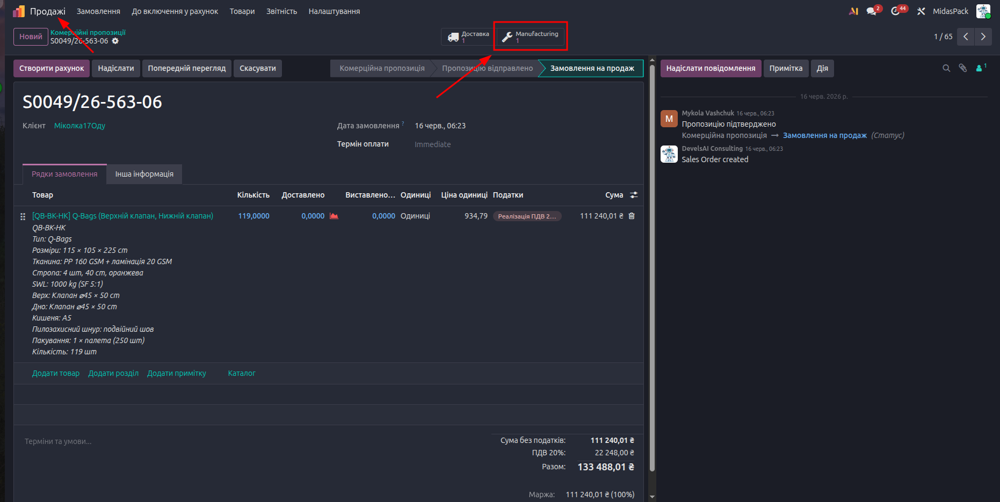

## Як потрапити у перелік всіх МО у модулі Виробництва
В цьому Вікні якщо ти встигнув натиснути кнопку 'Manufacturing' ти бачиш піктограму Продажі тому що ти переходив з цього модуля, ми просто наводимо на неї і ідемо по стрілочці у головне меню
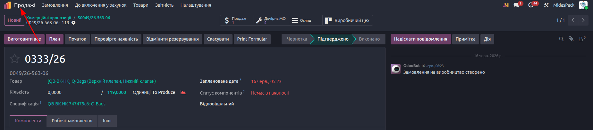

**Далі ми бачимо піктограму самого виробництва, натискаємо на неї**
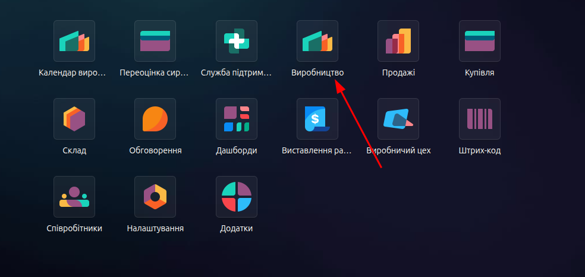

**Далі шлях у меню:** Операції → Замовлення на виробництво.
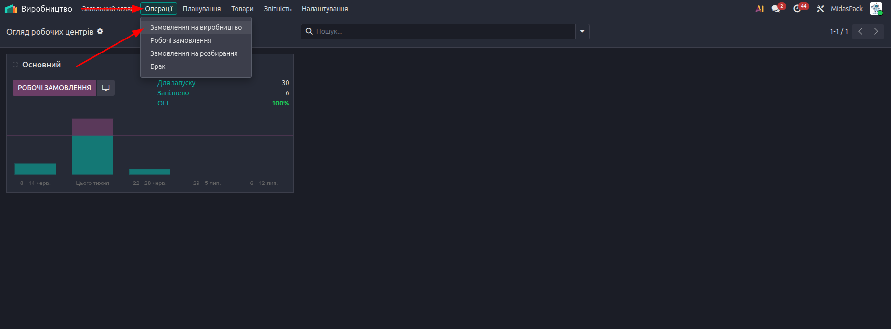

**Ми потрапляємо на екран всіх МО**
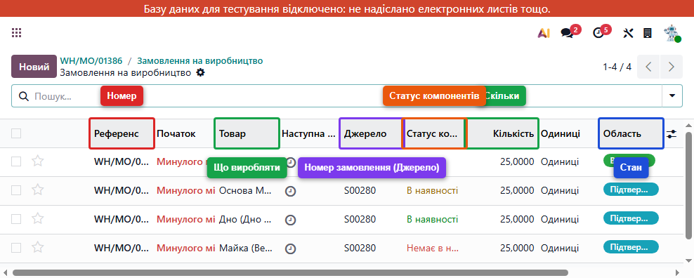

На цьому екрані ти бачиш усі замовлення на виробництво — і свіжі, і ті, що вже в роботі, і виконані. Колонки кажуть тобі:

- **Референс (номер)** — унікальний код, типу `WH/MO/01527` або `MO-01 150pcs`. Це твій орієнтир для пошуку.
- **Товар** — що саме треба виробити.
- **Кількість** — скільки штук за планом.
- **Джерело** — звідки прилетіло замовлення. Для дочірніх — це номер головного MO (наприклад `MO-01 150pcs`). Для головного — номер клієнтського замовлення (типу `S00XXX`) або порожнє, якщо створене виробничим планом без SO.
- **Статус компонентів** — кольоровий значок: **В наявності** (зелений) = все є, можна робити; **Очікує** = чекає інше замовлення; **Немає в наявності** (червоний) = бракує сировини.
- **Область (стан)** — на якій стадії: Чернетка → Підтверджено → У процесі → Виконано.

Твоя задача в чергу — взяти в роботу замовлення на виробництво зі станом **«Підтверджено»** і **зеленою позначкою «В наявності»**. Як їх розпізнати — у наступному розділі.

---

## 2. Як читається одне замовлення на виробництво

Натисни на рядок у списку — відкриється повна форма замовлення на виробництво. Тут вся інформація про це конкретне виробниче завдання.

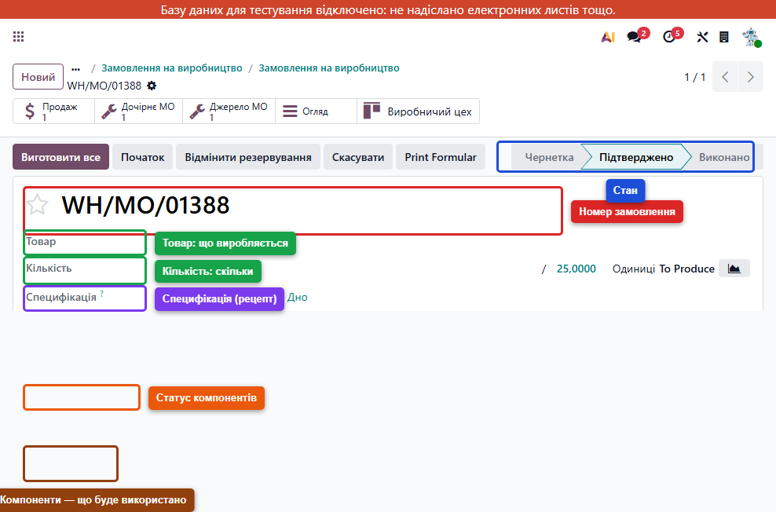

Що ти бачиш на формі:

- **Номер** угорі великими літерами (наприклад `WH/MO/01577`).
- **Товар і кількість** — що і скільки виробляєш.
- **Стан** угорі справа (Чернетка / Підтверджено / Виконано) — підсвічений поточний.
- **Статус компонентів** — кольоровий індикатор: зелена **«В наявності»** або **«Немає в наявності»**. Це найважливіше для рішення «можна робити чи ще ні».
- **Специфікація** — рецепт, за яким виробляється (Odoo сам підставляє).
- **Вкладка «Компоненти»** внизу — список того, що буде використано у виробництві. Поряд з кожним компонентом теж є кольоровий значок.

Просте правило: **стан «Підтверджено» + статус компонентів «В наявності» → можна виробляти**. Усе інше — поки чекаємо або з'ясовуємо.

## Партія/серійний номер

На формі деяких замовлень на виробництво побачиш поле 
**«Партія/серійний номер»** — одразу під полями Товар і Специфікація.

Це поле з'являється тільки на замовленнях **готової продукції** 
(біг-беги, майки). На дочірніх замовленнях (Полотно, Основа, Дно) 
його немає — це нормально.

Поле може бути порожнім — нічого вводити не треба. Коли натискаєш 
«Виготовити все», Odoo автоматично присвоює номер партії готовому товару.

Кнопка **«Generate Lot»** поруч дозволяє згенерувати номер заздалегідь, 
але це не обов'язково — система зробить це сама при виконанні замовлення.
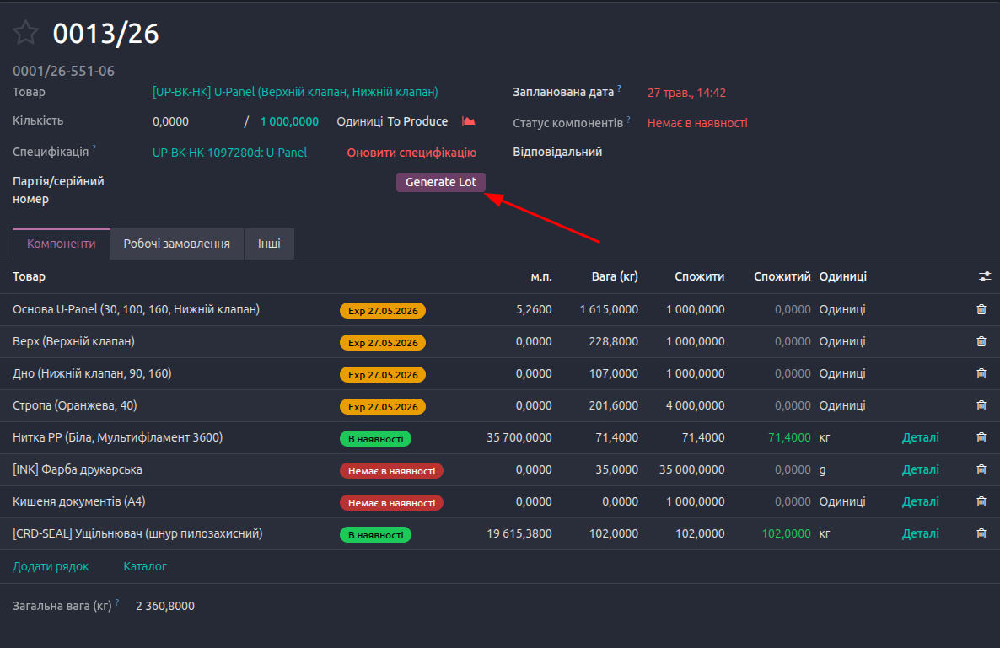
---

## 3. Одне замовлення на продаж = ціле дерево замовлень на виробництво

Один Біг-бег виготовляється з кількох частин: Основа, Верх, Дно, Стропа. Деякі з цих частин (Верх, Дно) теж не «з нічого» — вони виробляються з ще глибших напівфабрикатів: Полотно, Полотно Ламіноване, Труба Ламінована. Тому Odoo на один замовлений Біг-бег створює **відразу ціле дерево замовлень на виробництво** — окремо під кожну частину і кожен напівфабрикат, плюс одне головне на сам готовий Біг-бег.

Усі замовлення на виробництво в одному дереві мають однакове **Джерело**. Так ти бачиш, що це «одна команда» виробничих завдань.

**Дерево нашого прикладу `MO-01 150pcs`:**

```
MO-01 150pcs           ← КОРІНЬ: Біг-бег (Верхній клапан, Дно глухе), 150 шт
│                         + чиста сировина: Нитка PP, Фарба, Кишеня A4
│
├── WH/MO/01527  Основа (170, 200, 170), 150 шт
│                  ← Рукав (170, 200)  — сировина
│
├── WH/MO/01528  Верх (Верхній клапан), 150 шт
│   ├── WH/MO/01575  Труба Ламінована, 150 шт
│   │                  ← Рукав ламінований  — сировина
│   ├── WH/MO/01576  Полотно Ламіноване, 150 шт
│   │                  ← Тканина ламінована  — сировина
│   ├── + чиста сировина: Нитка PP, Тасьма
│
├── WH/MO/01529  Дно (Дно глухе, 80, 160), 150 шт
│   └── WH/MO/01577  Полотно (80, 160, 110), 150 шт
│                      ← Тканина (80, 160)  — сировина
│
└── WH/MO/01530  Стропа (Зелена, 40), 600 шт
                  ← Катушка Строп  — сировина
```

Дерево має **до 4-х рівнів глибини**: Тканина → Полотно → Дно → Біг-бег. Усі **8 замовлень** на виробництво в цій групі підтверджені одночасно, коли спрацював конфігуратор.

### Як зв'язані дочірні з головним

В Odoo це працює так: коли дочірнє замовлення виконано (наприклад `01577 Полотно` стало `Виконано`), готовий товар (Полотно) **не йде на загальний склад** — він **одразу резервується для свого батька** (`01529 Дно`). Те саме коли `01529 Дно` стає Done — Дно резервується для головного `MO-01`. Так працює весь ланцюг.

**Послідовність виробництва — знизу вгору.** Спочатку треба завершувати найглибші замовлення (рівень 3-4: Полотно, Полотно Ламіноване, Труба Ламінована), потім середні (Основа, Верх, Дно), і в останню чергу — головний `MO-01`.

Як зрозуміти що йде «першим» — дивися на статус компонентів:

- **«В наявності» / Assigned одразу** — найпростіше: треба тільки сировина зі складу, ніяких дочірніх не чекає. Починай звідси (`01530 Стропа`, `01575 Труба Ламінована`).
- **«Очікує» / Waiting** — це замовлення чекає, поки інше буде виконано. До нього доберешся пізніше.

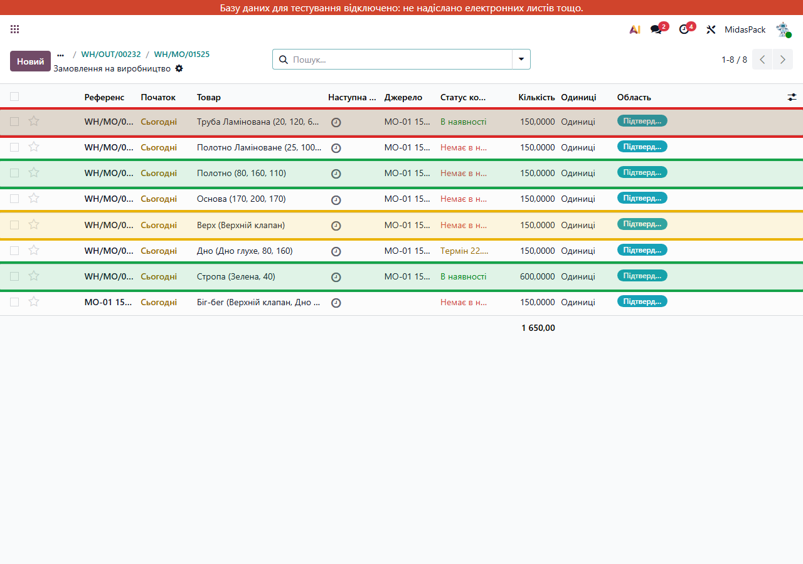

---

## 4. Один цикл виробництва — крок за кроком

Якщо ти прийшов від SO, тобто те, що описується у пункті 1 тоді на батьківському МО натискаємо смарт кнопку Дочірнє МО і вибираємо зі списку те яке потрібно **(або якщо ти на екрані всіх МО то інструкція описується нижче)**
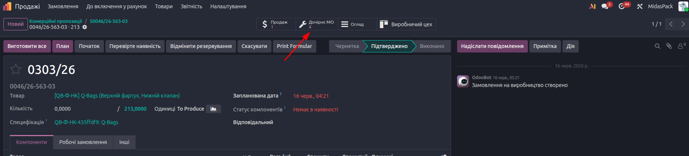
Робимо живий приклад: виконуємо найглибше дочірнє замовлення **`WH/MO/01577` — Полотно (80, 160, 110), 150 шт**.

**Крок 1.** Знайди замовлення у списку (через пошук зверху, ввівши `01577`), клацни — відкриється форма. Перевір: стан «Підтверджено», статус компонентів «В наявності» (зелене).

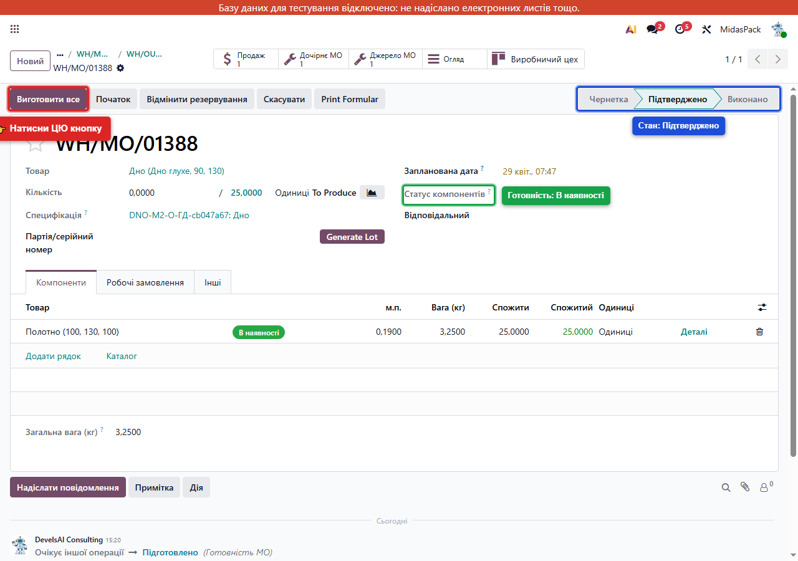

**Крок 2.** Натисни рожеву кнопку **«Виготовити все»** угорі ліворуч.

**Що станеться одразу:**
- Стан угорі переключиться на **«Виконано»**.
- На склад надійде 150 шт Полотна (80, 160, 110).
- Сировина — Тканина (80, 160) — спишеться у потрібній кількості.
- Усі 150 штук одразу зарезервуються для свого батька — `01529 Дно`. Стан `01529` стане «В наявності».
- У стрічці подій праворуч додасться запис «Виконано» з твоїм іменем і часом.
- На формі з'явиться нова кнопка **«Відстеження»** — звіт, який показує з якої сировини зроблено цю партію і куди потім поїде.

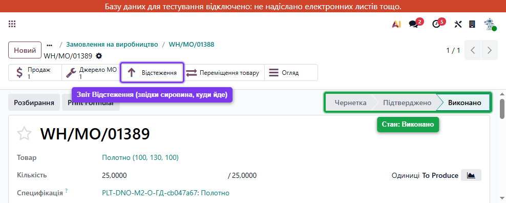

Все, замовлення на виробництво завершене. Тепер можна йти до наступного по дереву — наприклад `01529 Дно`, у якого тепер усі компоненти готові повертаючись по смарт кнопці Джерело МО або вийти знову у список і шукати по номеру.
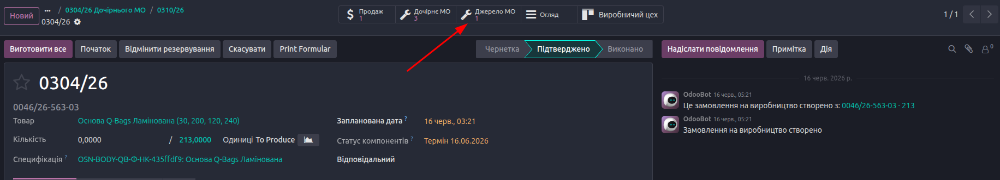

---

## 5. Якщо статус компонентів не зелений

Не кожне замовлення можна виконати одразу. Якщо ти відкрив форму і бачиш не зелене — ось що це значить і що робити.

**«Очікує»** (жовтий або синій значок): компонент потребує іншого замовлення на виробництво, яке ще не виконано. Це **нормально**, треба просто спочатку завершити то інше.

**«Немає в наявності»** (червоний значок): сировина закінчилась на складі. **Не намагайся натиснути «Виготовити все»** — Odoo не пропустить. Дій:

1. Подивись у вкладці «Компоненти», якого саме компонента бракує (червоний значок поруч з рядком).
2. Передай у відділ постачання чи на склад інформацію: бракує такого-то товару у такій-то кількості.
3. Коли товар з'явиться на складі — повертайся на замовлення і натисни **«Перевірте наявність»**. Якщо тепер всього вистачає, значок стане зеленим. Тоді можна Виготовити.

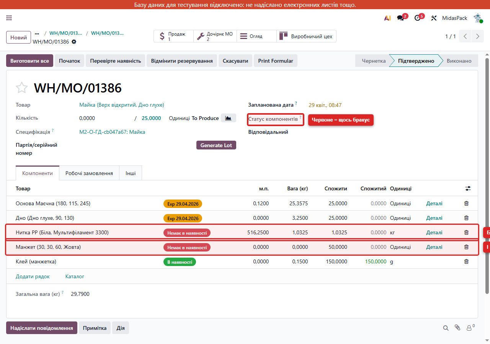

---

## 6. Виконання головного замовлення на виробництво (готовий Біг-бег)

Коли всі дочірні замовлення (на частини) виконано — приходить час головного замовлення на виробництво, того, що виготовляє готовий Біг-бег для клієнта. У нашому прикладі це **`MO-01 150pcs`**.

Воно **завжди** в одній «команді» з дочірніми (однакове джерело). Впізнати його легко за товаром: це той товар, який замовив клієнт (наприклад `Біг-бег (Верхній клапан, Дно глухе)`).

Перш ніж тиснути «Виготовити все», переконайся:
- Усі **дочірні замовлення** (на частини) — у стані «Виконано».
- **Власна сировина** головного замовлення (нитки, фарба, кишеня документів) — теж «В наявності» (зелена).

Якщо щось не так — натиснеш і Odoo покаже діалог **«Недійсна операція»** з переліком, чого саме бракує.

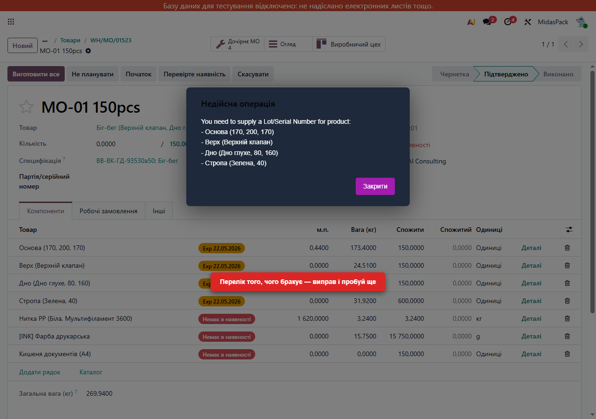

У такому випадку:
- Якщо в переліку **частини біг-бега** (Основа, Дно, Верх, Стропа): спочатку виконай ті дочірні замовлення на виробництво.
- Якщо в переліку **сировина** (Нитка, Фарба, Кишеня): передавай на склад/постачання, поповнюй.

Як усе виправиш — натискай «Виготовити все» ще раз. Тоді головне замовлення закриється і на склад надійде готовий Біг-бег у вказаній кількості.

---

## 7. Відвантаження готового товару клієнту

Якщо замовлення прилетіло з конфігуратора (з Sales Order), то як тільки головне замовлення на виробництво виконано, Odoo автоматично створює **Замовлення на доставку** — це той документ, за яким склад відвантажує клієнту.

**Шлях у меню:** Головне меню → Склад → Операції → Замовлення на доставку.

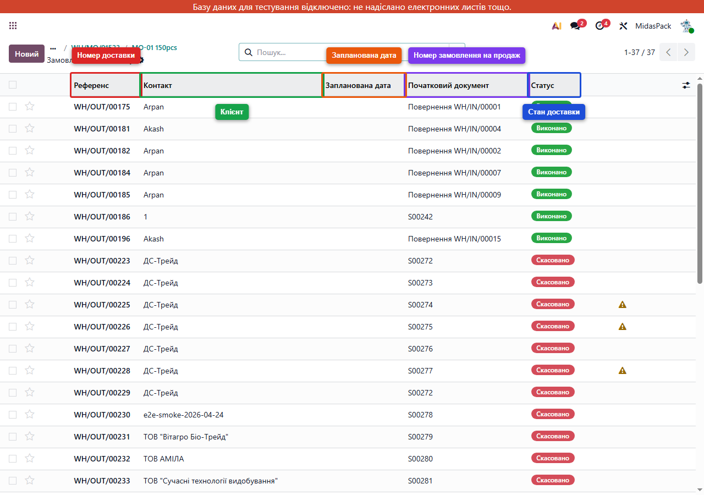

У списку шукай рядок з номером твого замовлення на продаж у колонці **Джерело**. Стан зазвичай **«Готово»** (зелене), якщо все виробництво завершилось.

Клацни — відкриється форма доставки.

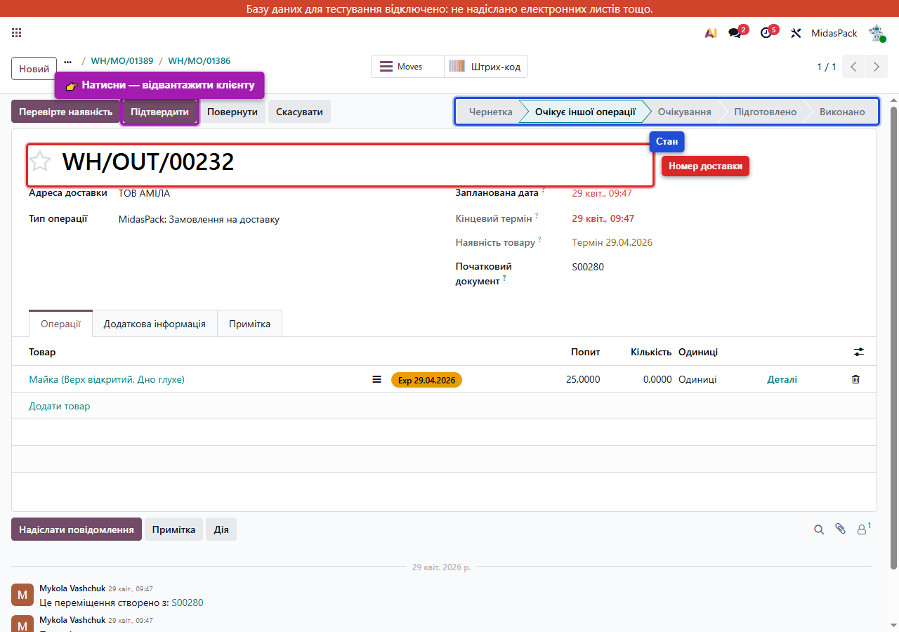

Натисни кнопку **«Підтвердити»** — товар спишеться зі складу до клієнта. У стрічці подій з'явиться запис «Виконано». На цьому замовлення повністю закрите.

**Зауваження:** якщо замовлення на виробництво створено не з конфігуратора, а як **виробничий план** (без SO) — то Замовлення на доставку **не з'являється** автоматично. Готовий товар просто лежить на складі. Це нормально для випадків коли виробляємо «у запас», а не під конкретного клієнта.

---

## 8. Ручна заміна сировини в одному замовленні

Іноді конфігуратор підібрав тканину одного типу, а виробництво хоче поставити інший (інший рулон, інший постачальник, виявлений брак тощо). У Odoo це можна зробити прямо у відкритому замовленні на виробництво — **тільки в стані Підтверджено** (у Чернетці теж можна; у Виконано вже не варто).

**Важливо одразу:** заміна стосується **тільки цього конкретного замовлення на виробництво**. Шаблон рецепту (Специфікація) в Odoo при цьому **НЕ змінюється** — на інші замовлення ця заміна не вплине.

### Як замінити сировину

Не намагайся клацнути прямо у назву компонента — у стані «Підтверджено» поле товару заблоковане. Робиться через **«видалити старий рядок → додати новий»**.

1. Відкрий замовлення на виробництво у стані «Підтверджено».
2. Переключись на вкладку **«Компоненти»**.
3. Праворуч на рядку з тим компонентом, який треба замінити, натисни **іконку кошику** 🗑 — рядок зникне.
4. Внизу таблиці натисни посилання **«Додати рядок»** — з'явиться порожній рядок.
5. У поле **Товар** введи назву того, на що замінюєш. Обери зі списку.
6. У поле **Спожити / Кількість** постав потрібну кількість (зазвичай ту саму, що була у старого).
7. Клацни у вільне місце — Odoo автоматично збереже.

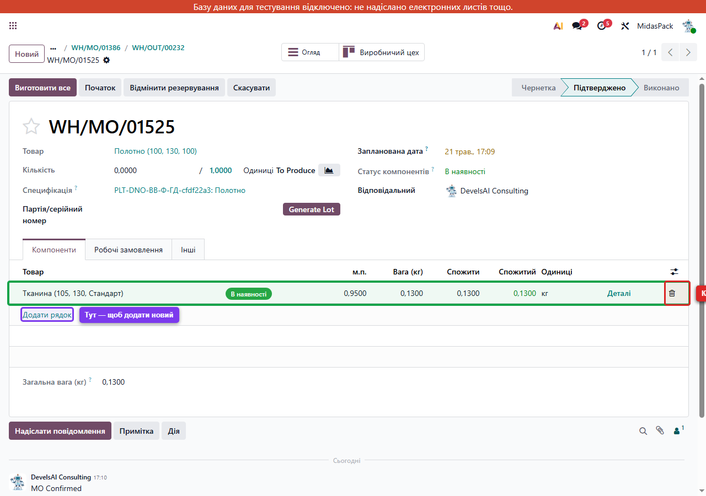

### Що відбувається відразу після

- **Резервація.** Якщо новий товар є на складі у потрібній кількості — Odoo сам перерезервує його. Статус компонента стане **«В наявності»** (зелене). Кнопку «Перевірте наявність» натискати не треба.
- **Якщо нового товару на складі недостатньо** — статус буде **«Немає в наявності»** (червоне). Тоді доводиться чекати поповнення складу, як описано в розділі 5.
- **Стан MO** не змінюється, лишається «Підтверджено».
- **Шаблонний рецепт (Специфікація)** залишається тим самим — там як був прописаний попередній товар, так і лишиться. Це **правильно**: заміна одна, а рецепт у конфігураторі один і не повинен переписуватись через одну ситуацію на виробництві.

Після заміни можна спокійно тиснути «Виготовити все», як зазвичай.

### Що ще можна робити з компонентами

- **Додати додатковий компонент:** натиснути «Додати рядок», вибрати товар і кількість. Той самий механізм, що при заміні. Корисно якщо реальна збірка потребує ще одного матеріалу, не передбаченого конфігуратором.
- **Видалити компонент без заміни:** натиснути іконку кошику і не додавати нічого. Корисно якщо реально без цього обходитесь.
- **Змінити кількість компонента:** клацнути просто в число у колонці «Спожити», ввести нове. Це працює навіть у Підтверджено (на відміну від назви товару).

### Важлива дірка: аудит заміни

У стрічці подій замовлення (праворуч, чатер) **запис про заміну сировини НЕ з'являється**. Тобто якщо завтра треба буде розібрати «хто і коли поставив іншу тканину в цьому замовленні» — слідів не буде. Видно лише факти «створено» і «підтверджено», без проміжних дій з компонентами.

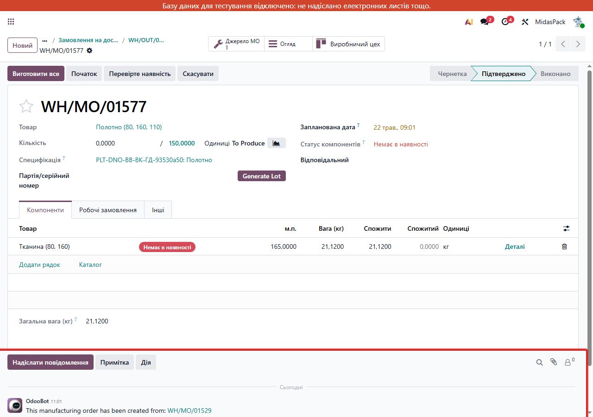

**Як з цим жити поки**: при кожній заміні **залишай примітку вручну** — натисни **«Надіслати повідомлення»** або **«Примітка»** у верхньому правому куті форми замовлення і коротко напиши: «Замінено [старий товар] на [новий товар], причина: […]». Так слід лишиться у чатері і завжди можна буде відновити що відбулось.

---

## 9. Як знайти потрібний товар у списку «Товари»

Іноді треба переглянути не замовлення, а сам товар — щоб подивитись скільки його на складі, який у нього BOM, або шукати конкретну варіацію. Зайти можна так:

**Шлях у меню:** Виробництво → Товари → Товари (або Склад → Товари — однаковий список).

У списку буде багато товарів — у dev-середовищі їх близько 70 штук. Щоб не загубитись, користуйся такими фільтрами:

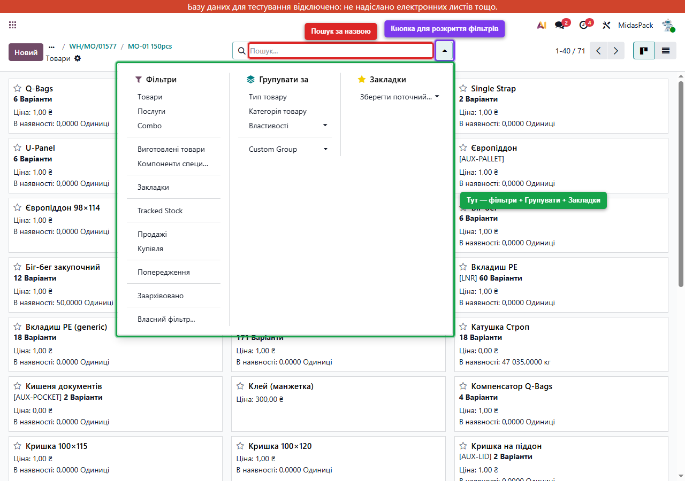

### Спосіб 1 — групувати за категорією

У правому верхньому куті натисни **«Групувати за»** → обери **«Категорія товару»**. Список одразу розділиться на групи:

- **Готова продукція** — готові Біг-беги, Майки. Те, що замовляє клієнт.
- **Напівфабрикати** — Основа, Верх, Дно, Полотно, Стропа, Труба Ламінована. Те, що виготовляється в межах одного замовлення.
- **Сировина** — Тканина, Рукав, Нитка, Фарба, Тасьма. Те, що купується або тримається на складі.

Це найшвидше «у голові навести порядок». Зверни увагу: частина товарів може бути без категорії (з'являється в групі «Undefined») — це окрема технічна задача для розробників, поки що такі товари шукай прямо по назві.

### Спосіб 2 — фільтрувати за маршрутом

У тому ж правому куті натисни **«Фільтри»** → знайди фільтри за маршрутом:

- **Manufacture** — все, що виробляється. Це готова продукція + напівфабрикати разом.
- **Buy** — все, що купується у постачальника (типу спеціалізовані матеріали).
- Без жодного маршруту — це чиста сировина, що лежить на складі сама по собі.

Корисно коли треба швидко зрозуміти «це у нас з купівлі чи з виробництва?».

### Спосіб 3 — пошук за назвою

У рядку зверху просто почни вводити частину назви: `Полотно`, `Тканина`, `80, 160`. Працює як завжди — фільтрує список по підрядку.

Найшвидший спосіб коли знаєш приблизно як товар називається.

---

## 10. Коли застряг — куди звертатись

Бувають ситуації, коли система поводиться не так, як описано. Не пробуй «вгадати» рішення — краще передай інформацію далі.

- **Червоний «Немає в наявності» довше доби** — звертайся в постачання.
- **На формі нема жодних кнопок, або форма виглядає дивно** — пиши Оксані.
- **Замовлення на виробництво у стані «Чернетка» і у нього порожнє поле «Специфікація»** — це баг конфігуратора. Не намагайся виправити сам, передавай розробникам (Дімі).

---

## Куди звертатись з питаннями до самої інструкції

Якщо щось у цій інструкції незрозуміло, або в Odoo вийшов на крок, якого тут нема — повідом Оксану. Документ буде доповнюватись.
